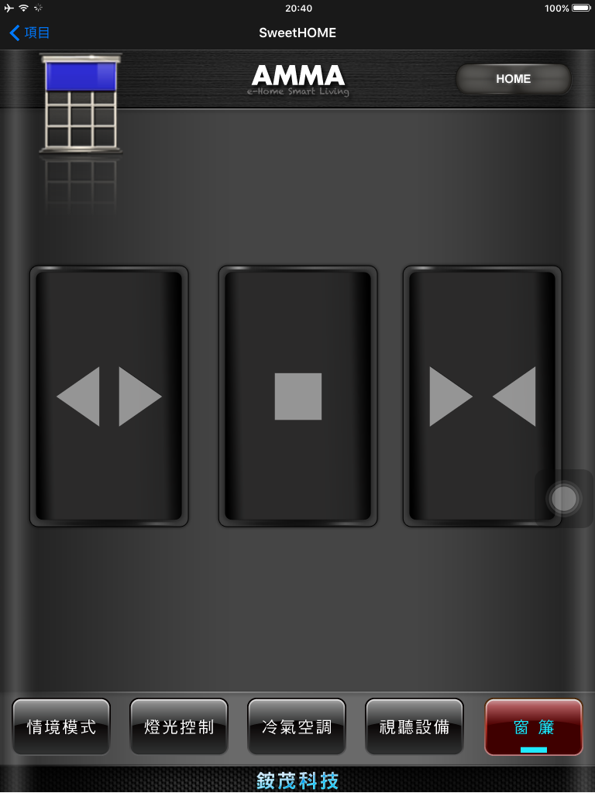
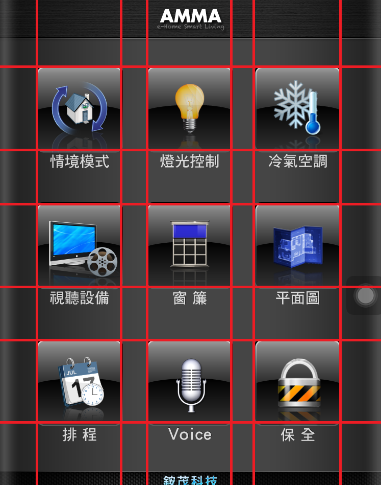
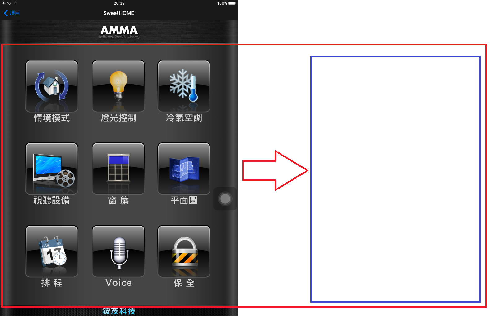
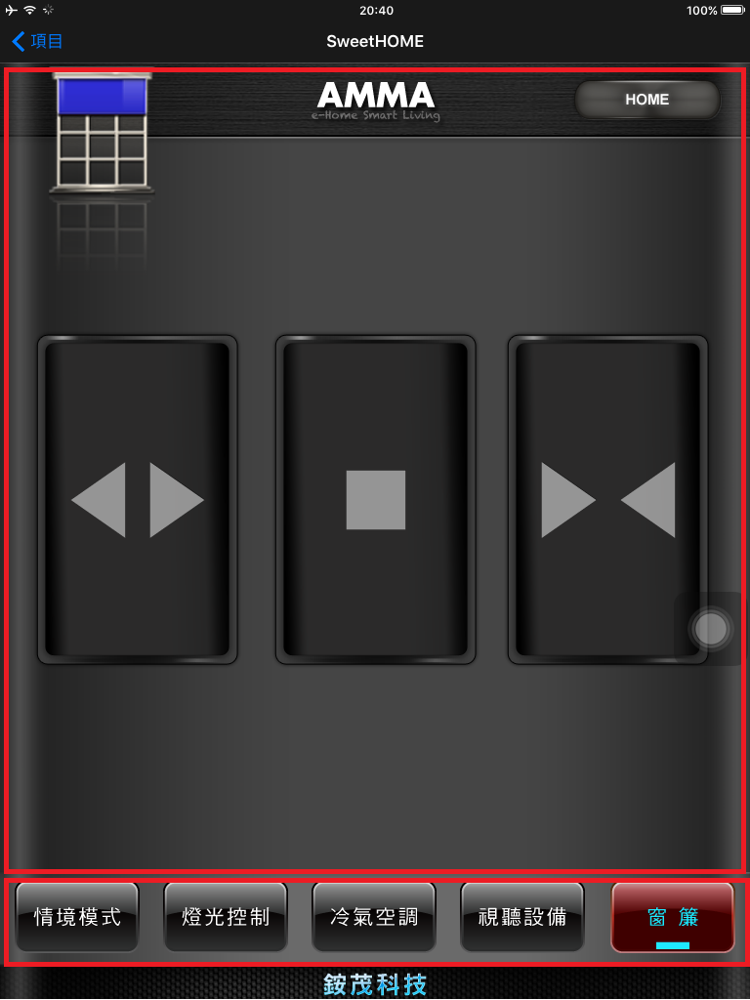

# 智慧家庭 - UI定義＆設計規範

[[TOC]]

## 整體UI採兩層架構：
- 歡迎頁面：
  首頁為歡迎頁面，列示所有頁面的集合，該按鍵以設備名稱或是空間名稱為主（以下將以設備按鍵稱之），能夠表示點選該按鍵要進入的控制功能項目的『功能頁面』。

  

- 功能頁面：
  功能頁面由兩個視窗框架結合，為功能按鍵集合視窗及設備按鍵集合視窗。
  功能按鍵排列依照該設備功能項目 Layout 定義排列，若該設備未定義，則依實際功能鍵數量對照每頁按鍵數量設計排列。
 
  

### Step By Step
透過step by step 預設將以該設備所有功能為一個控制頁面，因此可以很快速產生使用者控制介面。

### UI設計要點
一款UI設計圖與組態包含如下要點：

#### ICON
* 製作所有定義『設備清單』ICON 圖示（128x128),檔名為3位數 `iconID` 命名。
  ```
  例 ：
        乾衣機 06D.png
  ```

#### 頁面設計

1. 歡迎頁面設計 (`000_bg.png`, `000_bg_up.png`, `000_bg_dn.png`)
    設計該頁排滿設備按鍵的排列，按鍵設計不需要有文字與圖，系統會以該設備的 icon 填入，上下按鍵排列需考量好流設備名稱的文字。
    當實際運用時，該頁設備排滿，往左滑動可切換至第二頁。
    
    

2. 功能頁面設計 (`xxx_bg.png`, `xxx_bg_up.png`, `xxx_bg_dn.png`)<br>
   頁面除底圖與該設備功能按鍵外，必須含有兩項目：
    - HOME 按鍵：用來返回首頁（歡迎頁面）
    - Devices Bar : 該矩形長方將含有所有設備按鍵，用來切換至該設備項目頁的功能。

    

    - 製作所有定義『設備功能清單』頁面（底圖＋該頁按鍵`UP`+該頁按鍵`Down`）含排列 Layout 檔。
      ```
      以『乾衣機』為例:
          該頁面底圖 06D_bg.png
          該頁面所有功能按鍵排列圖,按鍵平常呈現圖樣,底圖採透明色 06D_bg_up.png
          該頁面所有功能按鍵排列圖,按鍵按下呈現圖樣,底圖採透明色 06D_bg_dn.png
          該頁面所有功能按鍵 Layout 檔 06D.json
      ```

    - 製作萬用頁面按鍵排列 Layout 檔 (default)。<br>
      (每頁分別設計可以放置以下數量按鍵：1,2,3,4,5,6,8,10)
      ```
      例： 
          萬用頁面按鍵排列（必要,共八種排列）
          該頁面只有一個功能按鍵 Layout 檔 funs_1.json
          該頁面有二個功能按鍵 Layout 檔 funs_2.json

          以『燈光』為例 (若無該項目則改採萬用頁面)
          該頁面只有一個功能按鍵 Layout 檔 011_1.json
          該頁面有二個功能按鍵 Layout 檔 011_2.json
          該頁面有五個功能按鍵 Layout 檔 011_5.json
          該頁面有八個功能按鍵 Layout 檔 011_8.json
          該頁面有十個功能按鍵 Layout 檔 011_10.json
      ```


3. 基本頁面清單

  |類型(類型ID)|名稱|ID|檔名|備註|
  |:---:|:---:|:---:|:---:|:---:|
  |頁面（00）|Index首頁|000|`000_bg.png`、`000_bg_up.png`、`000_bg_dn.png`|一頁排滿按鍵(基本作法) |
  | |設備項目列|deviceBar|`deviceBar_bg.png`、`deviceBar_bg_up.png`、`deviceBar_bg_dn.png`|一頁排滿按鍵 |
  | |萬用頁面|funs|`funs_n_bg.png`、`funs_n_bg_up.png`、`funs_n_bg_dn.png` (n=數量) | 每頁數量1,2,3,4,5,6,8,10(進階作法)|
  | |萬用頁面（有影像）|vfuns|`vfuns_n_bg.png`、`vfuns_n_bg_up.png`、`vfuns_n_bg_dn.png` (n=數量) | 每頁數量1,2,3,4,5,6,8,10(進階作法)|

## 附錄（一）設備項目定義
* APP呈現設備圖示依照 icon ID 顯示。
* 所有制定的設備,須製作 ICON 圖示 128 x 128 （Pixels）
* 該設備功能未明確定義將依據每頁定義按鍵數量排列。
( 設計8頁按鍵排列 Layout ,每頁分別可以放置以下數量按鍵：1,2,3,4,5,6,8,10 )


### 編碼格式(3位數16進制)
  |③|②|①|
  |:---:|:---:|:---:|
  |類型ID|類型ID|設備ID|

＊icon ID = ③②① (3位數)

### 設備清單
當該設備未有設計圖時，將採萬用頁面方式。

  |類型(類型ID)|設備名稱|icon ID|
  |:---:|:---:|:---:|
  |項目（01）|Light 燈光|011|
  | |Dimmer 調光|012|
  | |Scenes 情境|013|
  | |Wisdoms 智慧控制|014|
  | |Schedule 排程|015|
  | |Pushes|016|
  | |圖表|017|
  |馬達 (02)|窗簾|021|
  | |電動銀幕|022|
  | |升降架|023|
  |空調 (03)|冷氣|031|
  | |除濕機|032|
  | |空氣淨化器|033|
  | |加濕器|034|
  | |風扇|035|
  |顯示相關 (04)|電視|041|
  | |有線電視|042|
  | |電視盒|043|
  | |KTV|044|
  | |投影機|045|
  | |Media Center|046|
  | |MOD|047|
  | |衛星電視|048|
  |音響類 (05)|擴大機|051|
  | |CD|052|
  | |DVD|053|
  |廚衛類 (06)|冰箱|061|
  | |飲水機|062|
  | |淨水器|063|
  | |電熱水壺|064|
  | |咖啡機|065|
  | |烤箱|066|
  | |電鍋|067|
  | |豆漿機|068|
  | |暖奶器|069|
  | |抽油煙機|06A|
  | |香薰机|06B|
  | |洗衣機|06C|
  | |乾衣機|06D|
  | |熱水器|06E|
  |感測(07)|感測器|071|
  | |PM2.5空氣檢測|072|
  | |溫濕度計|073|
  | |電表|074|
  |其他(08)|門鎖|081|
  | |插座|082|
  | |掃地機器人|083|
  | |智能床|084|
  | |IPCAM|085|
  | |Ｇroup 群控|086|
  | |模式（ON/OFF)|087|

## 附錄（二）功能項目定義
* APP呈現功能按鍵上的圖示依照 icon ID 顯示。
* 所有制定設備功能,須製作相對應 ICON 圖示（128x128）
* 各設備功能的排列 Layout 該功能鍵須符合該`功能ID`。


### 編碼格式 (2 位數 16 進制)
  |②|①|
  |:---:|:---:|
  |功能ID|功能ID|

＊icon ID = ②① (2位數)

### 設備功能清單

  - 冷氣（031）

    |序號|功能|序號|功能|序號|功能|
    |:---:|:---:|:---:|:---:|:---:|:---:|
    |01|ON|12|風向-下|23|設定溫度桿|	
    |02|OFF|13| |24|顯示環境溫度|
    |03|冷氣|14|20℃|25|顯示設定溫度|
    |04|暖氣|15|21℃|26	
    |05|送風|16|22℃|27	
    |06|除濕|17|23℃|28	
    |07|風速（強）|18|24℃|29	
    |08|風速（中）|19|25℃|2A	
    |09|風速（弱）|1A|26℃|2B	
    |0A|風速（微）|1B|27℃|2C	
    |0B|風速（靜）|1C|28℃|2D	
    |0C|風速自動|1D|29℃|2E	
    |0D|風向自動|1E|30℃|2F	
    |0E|風向-上|1F| |30	
    |0F|風向-中上|20| |31	
    |10|風向-中|21| |32	
    |11|風向-中下|22| |

  - 除濕機（032）

    |序號|功能|序號|功能|序號|功能|
    |:---:|:---:|:---:|:---:|:---:|:---:|
    |01|ON|12| |23| |	
    |02|OFF|13| |24	
    |03| |14| |25	
    |04| |15| |26	
    |05| |16| |27	
    |06|自動除濕|17| |28	
    |07|風速（強）|18| |29	
    |08|風速（中）|19| |2A	
    |09|風速（弱）|1A| |2B	
    |0A|風速（微）|1B| |2C	
    |0B|風速（靜）|1C| |2D	
    |0C|風速自動|1D| |2E	
    |0D|風向自動|1E| |2F	
    |0E|設定濕度桿|1F| |30	
    |0F|顯示環境濕度|20| |31	
    |10| |21| |32	
    |11| |22| |

  - 電視（041）

    |序號|功能|序號|功能|序號|功能|
    |:---:|:---:|:---:|:---:|:---:|:---:|
    |01|ON|12| |23|下|	
    |02|OFF|13| |24|左|	
    |03|Vol+|14| |25|右|
    |04|Vol-|15| |26|OK|
    |05|Mute|16| |27|所有頻道 (*)|
    |06|CH+|17| |28|頻道返回 (#)|
    |07|CH-|18| |29|1|
    |08|選單|19| |2A|2|
    |09|HOME|1A| |2B|3|	
    |0A|MyApps|1B| |2C|4|	
    |0B|返回|1C| |2D|5|
    |0C|節目導覽|1D| |2E|6|	
    |0D|離開|1E| |2F|7|
    |0E| |1F| |30|8|
    |0F| |20| |31|9|
    |10| |21| |32|0|
    |11| |22|上|

  - 有線電視（042）

    |序號|功能|序號|功能|序號|功能|
    |:---:|:---:|:---:|:---:|:---:|:---:|
    |01|ON|12| |23|下|	
    |02|OFF|13| |24|左|	
    |03|Vol+|14| |25|右|
    |04|Vol-|15| |26|OK|
    |05|Mute|16| |27|mail(*)|
    |06|CH+|17| |28|往返(#)|
    |07|CH-|18| |29|1|
    |08|選單|19| |2A|2|
    |09|介紹|1A|播放|2B|3|	
    |0A|節目表|1B|暫停|2C|4|	
    |0B|SMOD首頁|1C|迴轉|2D|5|
    |0C|回前頁|1D|快轉|2E|6|	
    |0D|離開|1E|停止|2F|7|
    |0E|R|1F|上一段|30|8|
    |0F|G|20|下一段|31|9|
    |10|Y|21|錄影|32|0|
    |11|B|22|上|

  - 電視盒（043）

    |序號|功能|序號|功能|序號|功能|
    |:---:|:---:|:---:|:---:|:---:|:---:|
    |01|機上盒ON|12|電視OFF|23|下|	
    |02|機上盒OFF|13| |24|左|	
    |03|Vol+|14| |25|右|
    |04|Vol-|15| |26|OK|
    |05|Mute|16| |27|del(*)|
    |06| |17| |28|e(#)|
    |07|AV/TV|18| |29|1|
    |08|TV Vol+|19| |2A|2|
    |09|TV Vol-|1A|播放|2B|3|	
    |0A|左鍵|1B|暫停|2C|4|	
    |0B|返回|1C|迴轉|2D|5|
    |0C|HOME|1D|快轉|2E|6|	
    |0D|選單|1E|停止|2F|7|
    |0E| |1F|上一段|30|8|
    |0F| |20|下一段|31|9|
    |10| |21|錄影|32|0|
    |11|電視ON|22|上|

  - KTV（044）

    |序號|功能|序號|功能|序號|功能|
    |:---:|:---:|:---:|:---:|:---:|:---:|
    |01|ON|12|刪除|23|下|	
    |02|OFF|13|暫停|24|左|	
    |03|男調|14|重唱|25|右|
    |04|女調|15|原伴唱|26|OK|
    |05|M|16|下一首|27|輸入|
    |06|音樂+|17|加入我的最愛|28|我的最愛168|
    |07|音樂-|18|開啟我的最愛|29|1|
    |08|Mic+|19|功能目錄|2A|2|
    |09|Mic-|1A|播放|2B|3|	
    |0A|Key+|1B|螢幕點歌|2C|4|	
    |0B|Key-|1C|語種點歌|2D|5|
    |0C|切歌|1D|歌星點歌|2E|6|	
    |0D|更改|1E|拼注音點歌|2F|7|
    |0E|插播|1F|我的最愛|30|8|
    |0F|查詢|20| |31|9|
    |10|中止|21| |32|0|
    |11|跳出|22|上|

  - 投影機（045）

    |序號|功能|序號|功能|序號|功能|
    |:---:|:---:|:---:|:---:|:---:|:---:|
    |01|ON|12| |23| |	
    |02|OFF|13| |24	
    |03|PC1|14| |25	
    |04|PC2|15| |26	
    |05|Video1|16| |27	
    |06|Video2|17| |28	
    |07|BLACK ON|18| |29	
    |08|BLACK OFF|19| |2A	
    |09| |1A| |2B	
    |0A| |1B| |2C	
    |0B| |1C| |2D	
    |0C| |1D| |2E	
    |0D| |1E| |2F	
    |0E| |1F| |30	
    |0F| |20| |31	
    |10| |21| |32	
    |11| |22| |

  - Media Center（046）

    |序號|功能|序號|功能|序號|功能|
    |:---:|:---:|:---:|:---:|:---:|:---:|
    |01|ON|12| |23|下|	
    |02|OFF|13| |24|左|	
    |03|Vol+|14| |25|右|
    |04|Vol-|15| |26|OK|
    |05|Mute|16| |27| |
    |06|CH+|17| |28| |
    |07|CH-|18| |29| |
    |08|開始|19| |2A| |
    |09|DVD功能表|1A|播放|2B| |	
    |0A|我的音樂|1B|暫停|2C| |	
    |0B|我的圖片|1C|迴轉|2D| |
    |0C|我的視訊|1D|快轉|2E| |	
    |0D|我的電視|1E|停止|2F| |
    |0E|上一個|1F|上一段|30| |
    |0F|更多資訊|20|下一段|31| |
    |10| |21|錄影|32| |
    |11| |22|上|

  - MOD（047）

    |序號|功能|序號|功能|序號|功能|
    |:---:|:---:|:---:|:---:|:---:|:---:|
    |01|機上盒ON|12|電視OFF|23|下|	
    |02|機上盒OFF|13| |24|左|	
    |03|Vol+|14| |25|右|
    |04|Vol-|15| |26|OK|
    |05|Mute|16| |27|原頻道(*)|
    |06|CH+|17| |28|語言(#)|
    |07|CH-|18| |29|1|
    |08|資訊|19| |2A|2|
    |09|電視頻道|1A|播放|2B|3|	
    |0A|節目表|1B|暫停|2C|4|	
    |0B|SMOD首頁|1C|迴轉|2D|5|
    |0C|回前頁|1D|快轉|2E|6|	
    |0D|R|1E|停止|2F|7|
    |0E|G|1F|上一段|30|8|
    |0F|Y|20|下一段|31|9|
    |10|B|21| |32|0|
    |11|電視ON|22|上|

  - 衛星電視（048）

    |序號|功能|序號|功能|序號|功能|
    |:---:|:---:|:---:|:---:|:---:|:---:|
    |01|ON|12| |23|下|	
    |02|OFF|13| |24|左|	
    |03|Vol+|14| |25|右|
    |04|Vol-|15| |26|OK|
    |05|Mute|16| |27| |
    |06|CH+|17| |28| |
    |07|CH-|18| |29|1|
    |08|聲音切換|19| |2A|2|
    |09|再生|1A| |2B|3|	
    |0A|映像切換|1B| |2C|4|	
    |0B|預約一覽|1C| |2D|5|
    |0C|畫面表示|1D| |2E|6|	
    |0D|番組說明|1E| |2F|7
    |0E|衛星切換|1F| |30|8|
    |0F|錄影|20| |31|9|
    |10|Enter|21| |32|0|
    |11| |22|上|

  - 擴大機（051）

    |序號|功能|序號|功能|序號|功能|
    |:---:|:---:|:---:|:---:|:---:|:---:|
    |01|ON|12|PC|23| |	
    |02|OFF|13|MOD|24| |
    |03|Vol+|14|VIDEO|25| |
    |04|Vol-|15| |26| |
    |05|Mute|16| |27| |
    |06|Tuner|17| |28| |	
    |07|Aux|18| |29| |
    |08|DVD|19| |2A| |
    |09|BD|1A| |2B| |
    |0A|CD|1B| |2C| |
    |0B|VCR|1C| |2D| |
    |0C|TV|1D| |2E| |
    |0D|HDMI|1E| |2F	
    |0E|Apple TV|1F| |30| |	
    |0F|KTV|20| |31| |
    |10|DSP|21| |32| |
    |11|Surround|22| |

  - CD（052）

    |序號|功能|序號|功能|序號|功能|
    |:---:|:---:|:---:|:---:|:---:|:---:|
    |01|ON|12| |23| |	
    |02|OFF|13| |24| |
    |03|Vol+|14| |25| |
    |04|Vol-|15| |26| |
    |05|Mute|16| |27| |
    |06|播放|17| |28| |	
    |07|暫停|18| |29| |
    |08|迴轉|19| |2A| |
    |09|快轉|1A| |2B| |
    |0A|停止|1B| |2C| |
    |0B|上一段|1C| |2D| |
    |0C|下一段|1D| |2E| |
    |0D| |1E| |2F	
    |0E| |1F| |30| |	
    |0F| |20| |31| |
    |10| |21| |32| |
    |11| |22| |

  - DVD（053）

    |序號|功能|序號|功能|序號|功能|
    |:---:|:---:|:---:|:---:|:---:|:---:|
    |01|ON|12|右|23| |	
    |02|OFF|13|確定|24| |
    |03|Vol+|14|語言|25| |
    |04|Vol-|15|字幕|26| |
    |05|Mute|16|目錄|27| |
    |06|播放|17| |28| |	
    |07|暫停|18| |29| |
    |08|迴轉|19| |2A| |
    |09|快轉|1A| |2B| |
    |0A|停止|1B| |2C| |
    |0B|上一段|1C| |2D| |
    |0C|下一段|1D| |2E| |
    |0D| |1E| |2F	
    |0E|錄影|1F| |30| |	
    |0F|上|20| |31| |
    |10|下|21| |32| |
    |11|左|22| |

  - ONVIF（xxx）<br>
    Format: "`ONVIF`|`<ID>`|`<CH>`|`<Function>`"

    |序號|Function|
    |:---:|:---:|
    |01|VIDEO|
    |02|UP|
    |03|DOWN|
    |04|LEFT|
    |05|RIGHT|
    |06|`LEFT_UP`|
    |07|`LEFT_DOWN`|
    |08|`RIGHT_UP`|
    |09|`RIGHT_DOWN`|
    |0A|`ZOOM_IN`|
    |0B|`ZOOM_OUT`|
    |0C|`PTZ_STOP`|
    |0D|`SET_PRESET`|
    |0E|`GO_PRESET`|


## 製作點檢表 

  |項目|圖檔內容|備註 |
  | ------ | ------ | ------ |
  | □ 首頁(index) | `000_bg.png`、`000_bg_up.png`、`000_bg_dn.png` | 一頁排滿按鍵(基本作法) |
  | □ 設備按鍵列 | `deviceBar_bg.png`、`deviceBar_bg_up.png`、`deviceBar_bg_dn.png` | 一頁排滿按鍵 |
  | □ 萬用設備頁面 | `funs_bg.png`、`funs_n_bg_up.png`、`funs_n_bg_dn.png`(n=數量) | 每頁數量1,2,3,4,5,6,8,10(進階作法) |
  | □ 萬用設備頁面（有影像）| `vfuns_bg.png`、`vfuns_n_bg_up.png`、`vfuns_n_bg_dn.png`(n=數量) | 每頁數量1,2,3,4,5,6,8,10(進階作法) |
  | □ 冷氣（031）| `031_bg.png`、`031_bg_up.png`、`031_bg_dn.png` | |
  | ■ 除濕機（032）| `032_bg.png`、`032_bg_up.png`、`032_bg_dn.png` | |
  | ■ 電視（041）| `041_bg.png`、`041_bg_up.png`、`041_bg_dn.png` | |
  | ■ 有線電視（042）| `042_bg.png`、`042_bg_up.png`、`042_bg_dn.png` | |
  | ■ 電視盒（043）| `043_bg.png`、`043_bg_up.png`、`043_bg_dn.png` | |
  | □ KTV（044）| `044_bg.png`、`044_bg_up.png`、`044_bg_dn.png` | |
  | ■ 投影機（045）| `045_bg.png`、`045_bg_up.png`、`045_bg_dn.png` | |
  | □ Media Center（046）| `046_bg.png`、`046_bg_up.png`、`046_bg_dn.png` | |
  | □ MOD（047）| `047_bg.png`、`047_bg_up.png`、`047_bg_dn.png` | |
  | □ 衛星電視（048）| `048_bg.png`、`048_bg_up.png`、`048_bg_dn.png` | |
  | ■ 擴大機（051）| `051_bg.png`、`051_bg_up.png`、`051_bg_dn.png` | |
  | ■ CD（052）| `052_bg.png`、`052_bg_up.png`、`052_bg_dn.png` | |
  | ■ DVD（053）| `053_bg.png`、`053_bg_up.png`、`053_bg_dn.png` | |
  | □ IPCam(085)| `085_bg.png`、`085_bg_up.png`、`085_bg_dn.png` | 一頁內容：上方一個影像視窗`、`下方排滿按鍵 |

>## 補充說明

① 預設直接產生 採模組下各設備為一頁(含系統模組下：情境、智慧場景、排程) 

② 自訂新增  > 選擇一款設備(關係到 icon,功能按鍵圖) > 設定相關功能按鍵 對應 實際設備功能

```js
 ※ 若無相對應設備 Layout, 採"其他"頁面方式使用一頁排滿 並且設備頁面的底圖左上方位置嵌入icon
 ※ 若按鍵功能 icon 可由使用者異動設置
 ※ 設備 icon 運用: 首頁按鍵
 ※ 採Item Button (上圖下文字), 其文字高比例約為圖高的 1/5
 ※ PageIcon 1230:(15,0,150,150) 150/1230=0.12  > w = page.widthx0.12 > 比例：(w/10,0/w,w)
 ```

