系統架構
---

* 所有控制設備須在同一區域網路內，經由本地服務器統一管理。
* 系統服務器經由插件方式 (通訊轉換模組) 連接 (RS-232/485、TCP/IP) 各控制設備，取得各控制設備上的子設備 (燈光開關/Dimmer、冷氣、音響) 名稱及狀態。
* 服務器收到各設備的狀態，在個人終端設備上可反應這些狀態。另可根據個人偏好設定接收特定訊息 (如警報觸發、門禁異常等，此類訊息為 Server Push，提供 iOS 及 Android 設備上)。
* 服務器對這些訊息皆有記錄存檔。
* 若要由 Internet 存取網內各設備狀態，則系統服務器需能經由防火牆 (或 IP 分享器) 轉入，或經由公共的服務器來轉接 (由本單位提供或廠家自行架設)。
* 可連接雲端服務器提供統一管理、資料分析等功能。

