通訊協定示意圖
---

通訊協定細節於通訊協定項目中說明。

#### Cmd:
* 0: Ping (或稱 Heartbeat、None)。
* 1: 設定狀態, Value → [Device / Function]。
* 2: 狀態回應, [Device / Function] → Value。
* 3: 查詢所有或指定設備/功能狀態。
* 80 ~ 89: Apps ↔ Server 取得/儲存終端用戶組態資訊。
* 90: 登入。
* 91: 登入回應。
* 98: 解除 Module 註冊，釋放 Queue。

#### RPC:
* 99:  註冊 Module / Devices / Functions / Types。
