通訊轉接模組功能
---

### 功能概述
* 每一通訊轉接模組可能接１到數個設備，請自行定義通訊協定所需的設備及各功能 ID (文數字組合)。
* 本模組負責轉換本地設備和伺服器的通訊協定：
    1. 定義通訊協定設備及功能 ID 和內部指令的對照轉換。
    2. 當從設備功能收到異動狀態值時，轉換成通訊協定 JSON 格式，送往伺服器 (Public Queue)。
    3. 當從伺服器 (Private Queue) 收到 JSON 命令時，依指定命令將 Value 送往本地的設備。
* 第一次以 RPC 方式向管理系統註冊 (設備/功能/類型/值域/說明/UI 元件)，並取得模組 ID (相當於 Private Queue ID) 及 auth-token (身份驗證令牌)。
* 當設備取得最新狀態時，若未變更則不需送往伺服器。除非該設備需定時記錄繪製統計圖表 (如温度、濕度、PM2.5)。

### 預估模組
* RS232/485 模組。
* ModBus 模組。
* Amma TCP/485 模組。

### 銨茂通訊模組


<b id="rs485"></b>

<small>註: RS-485 設備亦包含 TCP 轉 485 轉接器</small>

#### 模組事件

以下事件供額外監測使用，本系統各模組已自行關聯必要的事件處理

1. AmAdaptor
    * `publish(string|string[])`: devices 模組監測用，將 "`|<did>|<fid>|status`" 加上前置 "`<sid>|<mid>`" 後再送往系統 MQ。
    * `_write(Buffer)`: AmTcp 或 Am485 模組監測用，將指定 `Buffer` 送往實體設備。
    * `error(Error)`: 發生錯誤原因。
    * `packet(Buffer)`: 收到實體設備送來分析過的完整封包。
    * `device(id: string, type: string)`: AmAdaptor.queryDevice() 中使用，收到設備識別查詢回覆。
    * `qfull(Buffer)`: `write(Buffer)` 未能立即輸出時，且緩衝暫存區已達到指定最大數量 `opts.maxQueues`。
    * `qempty()`: 輸出緩衝區已清空。

2. AmTcp 或 Am485
    * `connect(...)`: 連線成功。
    * `error(Error)`: 發生錯誤原因，根據 `opts.reconnect` 決定是否再次執行連線。
    * `close(hasError: boolean)`: 連線結束，根據 `opts.reconnect` 決定是否再次執行連線。
    * `timeout()`: tcp 逾時無回應，根據 `opts.reconnect` 決定是否再次執行連線。
    * `blocked()`: 設備輸出時是否系統緩衝空間已滿。
    * `drain()`: 設備輸出緩衝已清空，僅曾發生 `blocked` 事件後才會有。
    * `read(Buffer)`: 設備發生讀取事件。
    * `write(Buffer)`: 設備發生輸出事件。

#### 組態檔

1. devices 模組: devices.json
    ````json
    {
        "token": "*授權令牌*",
        "version": 1,
        "name": "AMMA",
        "devices": {
            "1": {
                "type": "tcp",
                "host": "192.168.1.38",
                "port": 5300,
                "opts": {
                    "autoQuery": true,
                    "reconnect": true,
                    "reconnectPeriod": 30000,
                    "timeout": 30000
                }
            },
            "2": {
                "type": "485",
                "ttyname": "ttyUSB01",
                "opts": {
                    "autoQuery": true,
                    "reconnect": true,
                    "reconnectPeriod": 30000,
                    "timeout": 30000,
                    "open": {
                        "baudRate": 9600,
                        "dataBits": 8,
                        "parity": "none",
                        "stopBits": 1
                    }
                }
            }
        }
    }
    ````
    * `token`: 第一次模組向系統註冊時取得，以後當組態有異動時必須以此令牌向系統要求異動之。
    * `version`: 每次異動時 (增減實體介面設備，或異動各介面設備的組態) 請變更此版號。回應給系統時，會將各介面設備的累計版號加上此欄位 `version`。
    *  `devices`: 為各實體介面設備 (tcp 或 485，其 `id` 必須為數值字串 "`1~255`") 的連線資訊。以上範例中 `opts` 的內容為預設值，可省略或請視實際情況調整:
        + `autoQuery`: 主動輪詢此介面下的所有設備狀態。
        + `reconnect`: 斷線後自動重連此實體介面設備。
        + `reconnectPeriod`: 重新連線的等待時間 (ms)。
        + `timeout`: 連線最大等待時間 (ms)。
        + `open`: 此為 RS-485 的連線參數。

1. AmAdaptor 模組: `XX`-config.json: `XX` 為兩個十六進位值 (`01`~`FF`，大寫)
    ````json
    {
        "options": {
            "maxQueues": 10,
            "minLatency": 100,
            "maxLatency": 500,
            "qmodLatency": 125,
            "qryLatency": 200,
            "readLatency": 30,
            "unrespCount": 5
        },
        "devList": {
            "01": "100"
        },
        "map": {
            "01|DM01": "A01|DM01",
            "01|DM03": "A01|DM03",
            "01|DM04": "A01|DM04"
        },
        "devices": {
            "A01": {
                "name": "調光",
                "type": "AM-100",
                "version": 2,
                "icon_id": "012",
                "functions": {
                    "DM01": {
                        "name": "研發部",
                        "type": 3,
                        "value": "100"
                    },
                    "DM03": {
                        "name": "辦公室A",
                        "type": 3,
                        "value": "100"
                    },
                    "DM04": {
                        "name": "工程部",
                        "type": 3,
                        "value": "100"
                    }
                }
            }
        }
    }
    ````
    * `options`: 以上範例的內容為預設值，請參考 [RS-485 設備輸出延時圖](#rs485):
        + `maxQueues`: 輸出命令時最大等待列隊數量。
        + `minLatency`: 輸出控制命令保護時間 (最小延遲時間 ms)
        + `maxLatency`: 輸出查詢命令無回應時最多等待時間 (最大延遲 ms)
        + `qmodLatency`: 在查詢模組型別時最多等待時間 (ms)
        + `qryLatency`: 收到回覆命令後延遲多少 ms 再進行下一輪輸出
        + `readLatency`: 在收到進來資料, 要保護多少 ms 才可進行輸出
        + `unrespCount`: 各設備 (銨茂模組) 未回應達到次數則視為失聯
    * `devList`: 此介面下有多少設備 (銨茂模組)，格式 `{ "id": "value" }`
        + `id`: 為兩個十六進位值 (`01`~`FF`)，每一實體介面最多可達 255 設備。
        + `value`: 為銨茂模組 ID，可為:
            value | 銨茂模組 | 說 明
            :---:|:---:|---
            100  | AM-100  | 調光 32 迴路
            210  | AM210   | 10 DO
            310  | AM310   | 12 PD
            DIO  | AM-DIO  | 6 PD, 8 DI, 6 DO
            311  | AM311   | 12 DI
            250  | AM-250  | 調光 2 迴路
            210S | AM-210S | 10 PD, 10 DO
            260  | AM-260  | 調光 6 迴路
            255  | AM-255  | 調光 4 迴路
            HEX  | AM-Hex  | 自定十六進位輸出碼
            IR   | AM-IR   | 紅外線模組
    * `map`: 為銨茂模組 ID 對照到 MQ 系統組態檔的 ID (`deviceID|funcID`)。實體模組的各個接點不一定使用，此時不需出現在此對照表及下項的 `devices` 中。
    * `devices`: 此為 MQ 系統組態檔所需資訊。
    * `pulses`: 可定義某一銨茂模組的自動延時關閉，如下例開門後 5 秒自動關閉門鎖
        ````json
        {
            "devList": {
                "02": "210"
            },
            "pulses": {
                "02": [0,0,0,0,0, 0,0,0,5000,0]
            },
            "map": {
                "02|DO01": "A03|DO01",
                "02|DO02": "A03|DO02",
                "02|DO09": "A02|DO09",
                "02|DO0A": "A02|DO0A"
            },
            "devices": {
                "A02": {
                    "name": "感測",
                    "type": "AM-210",
                    "version": 1,
                    "icon_id": "071",
                    "functions": {
                        "DO09": {
                            "name": "開門",
                            "type": 3,
                            "value": "1"
                        },
                        "DO0A": {
                            "name": "警報器",
                            "type": 3,
                            "value": "2"
                        }
                    }
                },
                "A03": {
                    "name": "燈光",
                    "type": "AM-210",
                    "version": 1,
                    "icon_id": "011",
                    "functions": {
                        "DO01": {
                            "name": "玄觀燈",
                            "type": 3,
                            "value": "2"
                        },
                        "DO02": {
                            "name": "客廳燈",
                            "type": 3,
                            "value": "2"
                        }
                    }
                }
            }
        }
        ````
    * `hex`: 敘述送出十六進位命令、群組 (狀態) 及 IR 等結構:
        ````json
        {
            "10": {
                "irid": 0,
                "defaultLatency": 1000,
                "1": {
                    "port": 15,
                    "group": [
                        [1,2],
                        [3,4,5,6],
                        [7,8,9,10,11,12],
                        [13,14,15,16,17,18]
                    ]
                },
                "2": {
                    "port": 4,
                    "group": [
                        [1,2],
                        [3,4,5,6],
                        [7,8]
                    ],
                    "latency": [[5000, 9,10,11,12]]
                }
            },
            "11": {
                "codes": {
                    "01": "E0,01,43,00,01,00,30,30,31,EF",
                    "02": "E0,01,43,00,01,00,30,30,32,EF",
                    "03": "E0,01,43,00,01,00,30,30,33,EF",
                    "04": "E0,01,43,00,01,00,30,30,34,EF",
                    "05": "E0,01,43,00,01,00,30,30,35,EF",
                    "06": "E0,01,43,00,01,00,30,30,36,EF"
                },
                "group": [ [1,2], [3,4,5,6] ]
            }
        }
        ````

#### 銨茂模組輸出入處理流程



