# App 處理流程

## 向本地伺服器註冊 (僅一次)

1. 在 LAN 端以 UDP 取得本地伺服器訊息: 參見 [Web API - App 尋找本地伺服器](../通訊協定/Web%20API.md#app-尋找本地伺服器)

1. 以 Web API 向本地伺服器註冊: 參見 [Web API - App 設備第一次要先向本地伺服器註冊](../通訊協定/Web%20API.md#app-設備第一次要先向本地伺服器註冊)
    1. 第一個要求註冊者視同系統管理者，擁有管理權限。
    1. 第二個起的註冊者，需向系統管理者取得授權碼。管理者經由 App 以 Web API 方式取得授權碼，再交給新用戶註冊用，參見 [系統管理者取得新用戶的授權碼](../通訊協定/Web%20API.md#系統管理者取得新用戶的授權碼)。
    1. 本地伺服器建立新帳號並回覆 MQTT 連線密碼。

    


## 登入系統

參見 [Web API - App 登錄取得身份驗證令牌](../通訊協定/Web%20API.md#app-登錄取得身份驗證令牌)

* 取得 MQTT 通訊時所需的資訊，即 Web API 返回的 `payload`:
    ```js
    {
        "router": "<routing key>",
        "queue": "<Queue Name>",
        "token": "<身份驗證令牌>"
    }
    ```


## MQTT 連線伺服器

以下所需格式參見 [MQTT 連線通訊協定](../通訊協定/MQTT%20通訊協定.md)

1. MQTT 連線驗證帳號及密碼:


1. 程式連線時取得伺服器設備組態，或以版本比對方式更新設備組態:
    1. 送出 App 現有模組/設備及版號。
    1. Server 回應有異動的模組/設備內容。
    1. App 可針對有異動的設備/功能通知用戶更改 UI 設定:
        * 對於新增設備/功能若不立即新增 UI 設定，並不影響現有用戶操控，只是從 UI 看不到這個新增功能的狀態及控制介面。
        * 對已刪除的設備/功能若不從 UI 中移除，UI 呈現應為停用狀態。

1. 等待 MQTT 接收狀態更新訊息，變更對應 UI 呈現狀態。

1. 用戶點選 UI 控制項目時，將對應的模組/設備/功能及變更值送往 MQTT。

