<h1>MQTT 通訊協定</h1>

[[TOC]]

## Node JS 範例

```js
const mqServer = {   // 來自 Web API: UDP
    "web_api": "https://example.com/api",
    "mqtt_host": "mqtt.example.com",
    "mqtt_port": 1883,
    "mqtt_ssl_port": 8883
}
const account = {   // 來自 Web API: create_device
    "device": "Sony XZ2",
    "loginid": "D2587",
    "password": "xxxxxxk6KWNbc3FxWWyyyyyy"
}
const mqtt_info = { // 來自 Web API: login
    "clientid": "1:A001-D2587(Sony XZ2)",
    "topic": {
        "pub": "to/",
        "sub": [ "from/#", "to/A001/#", "to/D2587/#" ]
    }
}

const client = require('mqtt').connect({
    connectTimeout: 10000,          // 10000ms
    clean: false,                   // not clean session
    reconnectPeriod: 1000,          // 1000ms
    keepalive: 60,                  // 60s
    host: mqServer.mqtt_host,
    port: mqServer.mqtt_ssl_port || mqServer.mqtt_port,
    protocol: mqServer.mqtt_ssl_port ? 'tls' : 'tcp',
    username: account.loginid,
    password: account.password,
    clientId: mqtt_info.clientid
})

client.subscribe(mqtt_info.topic.sub, {qos: 1}, (err, granted) => {
    if (err) {
        console.error('>>> Subscribe error:', err)
    } else {
        console.log('>>> Subscribe granted:', granted)
    }
})

client.on('connect', () => {
    console.log('>>> Connected.')
}).on('message', (topic, message, packet) => {
    console.log(`>>> Message: [${topic}:${packet.qos}] ${message}`)
    if (packet.dup) console.log('>>> Packet:', packet)
})

// 查詢所有模組組態
const packet = { cmd: 1, version: 0 }
client.publish(mqtt_info.topic.pub+'$YS/'+account.loginid,
                JSON.stringify(packet), {qos: 1})
```

## 關鍵名詞/符號說明

MQTT 訊息 key | 其他符號 |  說明
:--:|---|---
`"s_id"` | `<sid>` `服務器ID` `本地服務器ID` | 服務器短代碼 (4碼, 非 UDP 取得的本地服務器ID)，在雲端連線時給定，本地連線時可用空值表示本地主機。
`"c_id"` | `<cid>` | 客端設備登入的帳號 `__loginid__` (5碼)。
`"m_id"` | `<mid>` `模組ID` | 模組代號 (3碼), 模組註冊時由系統指派。
`"timestamp"` | `timestamp` | 時間戳記，自 1970-01-01 (UTC) 起的毫秒數。

有時會在關鍵字前後加上 `*` 或 `_`，表示特別強調該名詞:
* `**`: 由模組開發者自行定義。
* `*`: 由用戶 (App) 自行定義。
* `__`: 由系統或模組指派，在生命週期不可變更，如: `服務器ID`、`模組ID` 由系統指派，`設備ID`、`功能ID` 由模組開發者指派。
* `_`: 有固定值範圍。例如 `_version_` 表示版本數值，每個模組、設備的組態有自己的版號，每次異動時會漸增版號; 而 App 端可查詢組態儲存之，以後查詢時使用記錄的最後版號，以便得知是否有更新模組組態。


## 查詢服務器下各模組/設備組態 (cmd=1)

方向 | MQTT 主題
:---:|----
App → 服務器 | `to/$YS/<cid>`

<sup>註: MQTT 主題 為 [`<WebAPI>/login`](./Web%20API.md#app-登錄取得取得-mqtt-通訊時所需的資訊-login) 時所回應的 `topic.pub` + `"$YS/"` + `<cid>`</sup>

1. App 請求服務器所有模組組態:

    ```js
    {
        "cmd": 1,
        "version": _version_
    }
    ```

    * `_version_` 為版本數值，若服務器版本號碼大於請求方的值，則會送出該服務器所有模組組態。現存的版本號號從 1 計起，每次組態有變更會加 1，因此請求方的 `_version_` 為零則表示要求服務器重送出所有模組組態。

1. App 請求逐一比對指定服務器/模組/設備版本之後的組態:

    ```js
    {
        "cmd": 1,
        "payload": "服務器ID|模組ID|設備ID|_version_" // 或陣列
    }
    ```

    `服務器ID`:
    * 僅在雲端連線時才有效，本地主機未到雲端系統註冊前 `s_id` 內容均為空值。
    * 本地連線時可給空值表示本地主機本身。


### 服務器回應各模組/設備組態 (cmd=101)

方向 | MQTT 主題
:---:|----
服務器 → App | `to/<cid>/$YS`

1. 服務器回應新版本的模組/設備及其下的功能組態:

    ```js
    {
        "cmd": 101,
        "status": 0,
        "payload": {
            "s_id": "__服務器ID__",
            "version": _version_,
            "name": "**服務器名稱**",
            "modules": {                            // 模組物件
                "__模組ID__": {
                    "version": _version_,
                    "name": "**模組名稱**",
                    "devices": {                    // 設備物件
                        "__設備ID__": {
                            "version": _version_,
                            "name": "**設備名稱**",
                            "type": "**設備型號**",
                            "icon_id": "__設備項目id__",
                            "functions": {          // 功能物件
                                "__功能ID__": {
                                    "name": "**功能名稱**",
                                    "type": 3, // 輸入(可讀):1, 輸出(控制):2, 輸出入:3
                                    "value": "__值__", // 1, 2, 3, 100/n, n1~n2
                                    "icon_id": "__功能項目id__" // 若無可省略
                                },
                                // 其他功能
                            }
                        },
                        // 其他設備
                    }
                },
                // 其他模組
            }
        }
    }
    ```

    * `devices` 的 `icon_id`: 見 [UI 定義 & 設計規範 - 智慧家庭: 設備項目定義](../../App/UI定義＆設計規範-智慧家庭.md#附錄一-設備項目定義)。

    * `functions` 的 `icon_id`: 見 [UI 定義 & 設計規範 - 智慧家庭: 功能項目定義](../../App/UI定義＆設計規範-智慧家庭.md#附錄二-功能項目定義)。

    * `functions` 的 `type`: 定義功能為可讀取(狀態)或可輸出(控制)

        |  值  |     說明         |
        |:---:|------------------|
        |   1  | 可讀取狀態       |
        |   2  | 可輸出控制       |
        |   3  | 可讀取/輸出      |

        <sup>[註] 若為警報信號狀態，請回報 1 表示警報、0 表示正常狀態，以利接收端應用程式統一判斷。</sup>

    * `functions` 的 `value`: 定義功能輸出(控制)或讀取(回應)的值域

        |   值  |    說明                         | 控制狀態值 | 回應狀態值
        |:-----:|--------------------------------|----------|---
        |   1   | 一次觸發 (pulse)                | 1 或自定  | 0:關, 1:開, 2:異常<br>推播則為正進行中的筆數
        |   2   | 開/關 (on/off) 或<br>警報信號       | 0:關, 1:開,<br>2:切換 | 0:關/正常, 1:開/警報,<br>2:異常
        |   3   | 按下/放開 (press/release)       | 0:放開, 1:按下 | 0:放開, 1:按下, 2:異常
        |  100  | 調光 (0\~100%), 線性時間 | 0\~100[,線性秒數] | 0\~100
        | n1\~n2 | 指定某段範圍值, 如: 温度          | 指定範圍值 | 指定範圍值
        | 其他  | 模組自行定義 (不建議) | 自定 | 自定
        | | 設備/功能已失聯 | 無 | `null`

        <sup>[註] 回應狀態值 `2:異常` 表示在 `1:開啟/按下` 情況下的警告，例如保全智慧控制時發生入侵事件。</sup>

    * 系統攝影機模組 `functions` 資料結構及處理稍有不同，請參考 [系統攝影機模組](./系統攝影機模組.md)。


1. 若無新的版本則返回 `modules` 為 `null`:
    ```js
    {
        "cmd": 101,
        "status": 0,
        "payload": {
            "s_id": "__服務器ID__",
            "version": _version_,
            "name": "**服務器名稱**",
            "modules": null
        }
    }
    ```


1. 若 `__服務器ID__`、`__模組ID__` 或 `__設備ID__` 已不存在，則返 `_version_` 為 `0`:

    ```js
    {
        "cmd": 101,
        "status": 0,
        "payload": {
            "s_id": "__服務器ID__",
            "version": 10,
            "name": "**服務器名稱**",
            "modules": {
                "__模組ID__": {
                    "version": 0    // 此模組不存在
                },
                // 其他模組...
            }
        }
    }
    ```


## 模組/設備/功能狀態變更 (cmd=2)

1. 各通訊模組在設備/功能狀態有變更時，主動向本地服務器、App 送出最新狀態:

    方向 | MQTT 主題
    :---:|----
    通訊模組 → 本地服務器, App | `from/<mid>`

    ```js
    {
        "cmd": 2,
        "payload": "服務器ID|模組ID|設備ID|功能ID|最新狀態值" // 或陣列
    }
    ```

    * `payload` 中的第一個欄位 `服務器ID` 可以省略，通訊模組的訊息一定是送往本地主機。若要帶上 `服務器ID` 時一定是 `本地服務器ID`，否則此訊息會被丟棄。
    * 若同時有多組設備/功能狀態異動時， `payload` 可用陣列表示，例如:\
    `"payload": [ "|模組ID|設備ID|功能ID|最新狀態值", ... ]`

1. 本地服務器收到狀態變更:

    於 `payload` 欄位的 `服務器ID` 換置成 `本地服務器ID`，增加時戳欄位 `_timestamp_`，送往雲端系統:

    方向 | MQTT 主題
    :---:|----
    本地服務器 → 雲端服務器 | `from/<sid>/<mid>`

    ```js
    {
        "cmd": 2,
        "payload": "服務器ID|模組ID|設備ID|功能ID|最新狀態值", // 或陣列
        "timestamp": _timestamp_
    }
    ```

    * `_timestamp_` 為自 1970-01-01 (UTC) 起的毫秒數。對 App 而言，只要記住服務器最後一次的時間戳記，在斷線重連時要求重送此時間後的更新狀態即可，見隨後 [查詢模組/設備/功能最新狀態 (cmd=4)](#查詢模組設備功能最新狀態-cmd4)。


## 控制模組/設備/功能 (cmd=3)

由 App 或 `情境/智慧控制/排程/推播` 觸發送往通訊模組:

方向 | MQTT 主題
:---:|----
App → 通訊模組 | `to/<mid>/<cid>`

```js
{
    "cmd": 3,
    "payload": "服務器ID|模組ID|設備ID|功能ID|**欲變更狀態值**" // 或陣列
}
```

* 通訊模組收到時 `服務器ID`、`模組ID` 可不理會，每個通訊模組只會收到屬於自己的訊息。
* 若要同時控制多組設備/功能狀態時， `payload` 可用陣列表示，但其中每個項目的 `服務器ID|模組ID` 必須相同，且 `模組ID` 必須等於 MQTT 主題中的 `<mid>`。例如:\
`"payload": [ "服務器ID|模組ID|設備ID|功能ID|**欲變更狀態值**", ... ]`


## 查詢模組/設備/功能最新狀態 (cmd=4)

1. App 啟動或斷線重連後要求各模組/設備/功能的最新狀態:

    方向 | MQTT 主題
    :---:|----
    App → 服務器 | `to/$YS/<cid>`

    ```js
    {
        "cmd": 4,
        "payload": "服務器ID|模組ID|設備ID|功能ID|_timestamp_" // 或陣列
    }
    ```

* `_timestamp_` 表示查詢這個時間點後有異動的狀態。
* `payload` 中的 `模組ID|設備ID|功能ID` 可以由右向左省略，表示要求某一項目以下的狀態:
    * `服務器ID|模組ID|設備ID|功能ID|_timestamp_` 查單一功能狀態。
    * `服務器ID|模組ID|設備ID|_timestamp_` 查此設備下所有功能狀態。
    * `服務器ID|模組ID|_timestamp_` 查此模組下所有設備/功能狀態。
    * `服務器ID|_timestamp_` 查此服務器下所有模組/設備/功能狀態。
* 若同時要查詢多組設備/功能最新狀態時， `payload` 可用陣列表示，例如:\
`"payload": [ "服務器ID|模組ID|設備ID|功能ID|_timestamp_", ... ]`


### 回應指定時間點後各模組/設備/功能最新狀態 (cmd=104)

服務器收到查詢最新狀態，或通訊模組重新連線時主動送出:

方向 | MQTT 主題
:---:|----
服務器 → App | `to/<cid>/$YS`

```js
{
    "cmd": 104,
    "status": 0,
    "payload": [ "服務器ID|模組ID|設備ID|功能ID|狀態值|_timestamp_", ... ]
}
```

* `通訊模組 → 本地服務器` 時，`服務器ID` 為空值，且可省略 `_timestamp_` 欄位，本地服務器在收到各設備/功能狀能值時會自動記錄此時的時間戳記。
* 如果自指定時間後都沒有異動，則返回 `payload` 為空陣列:
    ```js
    {
        "cmd": 104,
        "status": 0,
        "payload": []
    }
    ```


## 查詢系統模組情境/智慧控制/排程/推播各功能內容 (cmd=5)

方向 | MQTT 主題
:---:|----
App → 系統模組 | `to/$00/<cid>`

App 請求系統模組各項目功能內容結構:

```js
{
    "cmd": 5,
    "payload": "服務器ID|模組ID|設備ID|_version_"
}
```

* `服務器ID`: 本地連線時可給空白。
* `模組ID`: 此處為 `$00`，`$` 加上兩個數字零。同 MQTT 主題的第二個欄位值。
* `設備ID`: 回應內容結構會根據各項目而有所不同

    設備ID | 項目名稱
    :---:|----
    SCENES | 情境
    WISDOMS | 智慧控制
    SCHEDULES | 排程
    PUSHES | 推播

* `_version_` 為版本數值，若服務器版本號碼大於請求方的值，則會送出該服務器所有模組組態。現存的版本號號從 1 計起，每次組態變更會加 1，因此請求方的 `_version_` 為零則表示要求服務器重送出指定模組/設備的內容結構。


### 系統模組回應查詢情境/智慧控制/排程/推播各功能內容 (cmd=105)

方向 | MQTT 主題
:---:|----
系統模組 → App | `to/<cid>/$00`

1. 若無新的版本則返回 `functions` 為 `null`:
    ```js
    {
        "cmd": 105,
        "status": 0,
        "payload": {
            "id": "SCENES",         // SCENES, WISDOMS, SCHEDULES, PUSHES
            "version": _version_,   // 最後的版號
            "functions": null
        }
    }
    ```

1. <b id="scenes">`SCENES`</b> 情境:

    ```js
    {
        "cmd": 105,
        "status": 0,
        "payload": {
            "id": "SCENES",
            "version": _version_,
            "functions": {
                "情境ID": {
                    "active": 0,            // 情境是否在執行中
                    "name": "*情境名稱*",
                    "comment": "*註解*",     // 註解: 本欄位為選項，僅供使用者自行運用
                    "mode": 1,              // 重疊執行處理模式
                    "actions": [            // <action-list>
                        // ...
                    ]
                },
                // 其他情境...
            }
        }
    }
    ```

    * `active`: 同通訊模組狀態變更回報。參見 [模組/設備/功能狀態變更 (cmd=2)](#模組設備功能狀態變更-cmd2)。對應代入: 模組=`$00`，設備=`SCENES`，功能=`情境ID`。情境在觸發控制時會回報狀態為 `1`，當所有動作執行完後會回報為 `0`，這段時間通常不會持續太久。
    * `comment` 欄位為選項，僅提供使用者註解用，當使用者曾指派過值時才會呈現。
    * `mode`: 重疊執行處理模式 (同一情境之前的還在執行中)

        值 | 說明
        :---:|---
        0 | 取消都不執行
        1 | 舊的取消，新的開始執行
        2 | 舊的繼續，新的不予執行
        3 | 舊的繼續，新的開始執行

    * `actions` 欄位內容為 `<action-list>`，用下列 ABNF 語法表示之:
        ```bnf
        action-list = "[" *1concurrent *( action / action-list ) "]"
        concurrent  = "C"

        ; action 是 JSON 物件，見下一項說明。
        ;
        ; 註: action-list 第一個值為 "C" 表示同時(Concurrent)執行各個動作，否則為循序執行。
        ;     當所有動作結束後才算本 action-list 結束。
        ```
    * `<action>` JSON 物件:\
        ```{ "id": "模組ID|設備ID|功能ID|**控制狀態值**" , "delay0": seconds }```
        + `id` 為要控制的內容。
        + `delay0` 為送出控制內容前延遲秒數 (精確度 0.1 秒)，若省略此欄位則為零 (不延遲)。
    * 當情境觸發時會先回應情境狀態為 `1`，當情境所有動作結束後會回應狀態為 `0`。因此若整個情境執行期間太快，呈現的執行中狀態會很短暫，此時可以在最後加上一個空動作 (`id` 為空值) 的適當延遲。

    範例:
    ```js
    {
        "cmd": 105,
        "status": 0,
        "payload": {
            "id": "SCENES",
            "version": 2,
            "functions": {
                "RDLightsOn": {
                    "active": 0,
                    "name": "研發燈光開",
                    "mode": 1,
                    "actions": [ "C",
                        { "id": "dsc|amLight-1|PD002|1", "delay0": 0 },
                        { "id": "dsc|amLight-1|PD003|1", "delay0": 0.5 },
                        { "id": "", "delay0": 1 }
                    ]
                },
                "RDLightsOff": {
                    "active": 0,
                    "name": "研發燈光關",
                    "mode": 1,
                    "actions": [ "C",
                        { "id": "dsc|amDimmer-0|001|0,5.0", "delay0": 0.5 },
                        [
                            { "id": "dsc|amLight-1|PD002|0", "delay0": 1 },
                            { "id": "dsc|amLight-1|PD003|0", "delay0": 1 }
                        ]
                    ]
                }
            }
        }
    }
    ```

1. <b id="wisdoms">`WISDOMS`</b> 智慧控制:

    ```js
    {
        "cmd": 105,
        "status": 0,
        "payload": {
            "id": "WISDOMS",
            "version": _version_,
            "functions": {
                "智慧控制ID": {
                    "active": 1,                // 是否啟用
                    "name": "*智慧控制名稱*",
                    "comment": "*註解*",        // 註解: 本欄位為選項，僅供使用者自行運用
                    "states": [ S1, S2, ..., Sn ],  // 狀態機
                    "exprsList": [ E1, E2 ..., En ] // 樹狀運算式 (參考用)
                },
                // 其他智慧控制...
            }
        }
    }
    ```

    * `active` 為智慧控制的狀態值，`0` 表示停用，`1` 表示啟用。
    * `comment` 欄位為選項，僅提供使用者註解用，當使用者曾指派過值時才會呈現。
    * `states` 狀態機為一群狀態 `Si`{i=1\~n} 組成的陣列: `[ S1, S2, ..., Sn ]`。
    * 狀態機一次只會在某一狀態下執行，啟動時由 S1 開始執行。當此狀態轉換進入、或關注的事件異動、或計時器觸發時，才會執行此狀態物件下的 `T[]` 移轉條件運算式評估、執行命令、是否移轉到另一狀態等處理。
    * 狀態 `Si`{i=1\~n} 為一群移轉項目陣列 `T[]`:
        ```js
        Si = [ T1, T2, ..., Tm ]    // 每一狀態含有數個移轉項目 T[] = Tj{j=1~m}
        Tj = {  // Tj{j=1~m} 移轉項目 (Transition)
                "expression": "*條件運算式*",
                "actions": [ ... ],         // <action-list>: 欲執行的命令
                "error": "*錯誤訊息*", // 若 `expression` 成立要送出的錯誤訊息
                "next": 0, // -1: 結束(智慧控制), 0: 不移轉(繼續下個), 1~n: 移轉到 S1~Sn
                "interval": 0 // 當 next=0 時, 表示 expression 成立後下次執行的間隔秒數
        }
        ```
        * `expression` (條件運算式): 可為各項 [`模組|設備|功能`]`:持續秒數` 值的條件比較運算式，`:持續秒數` 為可選項，例如:\
        `[模組ID|設備ID|功能ID]:300 >= 28`  // 某項温度持續 300 秒達到 28 度以上<br>\
        運算子 (符號) 及優先順序

            運算子              | 優先序 (高到低)    | 說明
            :-----------------:|:----------------:|-----
            `:`                | 最高              | <變數> `:` <持續秒數>
            `!` `!!` `~`       | 次高              | 一元運算(unary):<br>`!` 或 `not`: 反邏輯 (true, false)<br>`!!` 或 `bool`: 轉成邏輯值 (true, false)<br>`~`: 反位元 (位元 0 <-> 1)
            `*` `/` `%`        | 左到右            | 數值: 乘、除、整除取餘數
            `+` `-`            | 左到右            | 數值: 加、減
            `>` `>=` `<` `<=`  | 左到右            | 數值: 大於、大於等於、小於、小於等於
            `=` `==` `!=` `<>` | 左到右            | 數值: 等於、不等於
            `&`  `^`  `｜`     | `&` > `^` > `｜`  | 數值位元運算: 且、互斥、或
            `&&` `❘❘`       　 | 最低: `&&` > `❘❘` | 邏輯運算: 且 (`&&`, `and`)、或 (`❘❘`, `or`)

            1. 運算式中的外部變數須用 `雙引號`、`單引號` 或 `方括號` 包起來，外部變數是指本系統中 `模組｜設備｜功能` 的狀態值。當外部變數異動時，會引發現行狀態對應的移轉項目 (有引用此外部變數者) 進行評估處理。
            1. 智慧控制內部變數: (不分大小寫，於運算式中使用，不可用引號或方括號包起來)

                內部變數 | 說明
                :------:|---
                `errors` | 現行狀態 `Si` 執行週期時所發生的錯誤數<br>此錯誤是指 `T[1~m].error` 引發的個數
                `self` | 指目前智慧控制本身狀態，0:被中止, 1:執行中, 2:執行中+異常<br>相當於外部變數 [`$00｜WISDOMS｜本智慧控制ID`]

            1. 若不確定運算式的優先序，請用括號括起來，例如:\
            `[dsc|dido-0|DI001] == 1 && ([dsc|amLight-1|PD001] == 0 || [dsc|amLight-1|PD002] == 0)`
            1. 邏輯運算結果為 `true` 或 `false`。數值轉邏輯值: 非零為 `true`，零為 `false`。
            1. 邏輯值轉成數值運算時，`true` 轉為 `1`，`false` 轉成 `0`。不建議將邏輯值和數值拿來運算 (加、減、乘、除、比較)。
            1. 位元運算結果一定為整數，有效位數為 32 bits。
            1. 邏輯運算 (`not`, `!`)、(`bool`, `!!`) 會將 [`模組|設備|功能`]:`持續秒數` 中的 `:持續秒數` 轉成 true 或 false 的考慮因素之一，然後將延遲時間效果拿掉。例如:\
            檢查燈光開啟是否持續 60 秒以上: `運算式A` = `[dsc|amLight-1|PD001]:60 == 1`

                實際狀況 | `運算式A` | bool(`運算式A`) | !(`運算式A`)
                :---:|:---:|:---:|:---:
                燈光為關閉狀態 | false | false | true
                燈光已開啟 10 秒 | 延遲 50 秒後再檢查 | false | true
                燈光已開啟 ≥ 60 秒 | true | true | false

        * `actions`: 當 `expression` 評估滿足 (`true`) 時要執行的命令，請參照前項情境 (SCENES) 說明。
            1. `actions` 的總執行時間不宜過長，若因頻繁觸發引起大量的 `actions` 執行，可能會對系統造成不良影響。此時建議搭配 `interval` 來做適當的延遲保護。
            1. 若 `actions` 內容需要長時間 (數十秒以上) 執行時，最好先設定為情境，此時再以觸發該情境執行之，這樣該情境要等待的執行命令並不屬於本智慧控制的範圍。
            1. 在本智慧控制結束時，亦可指定執行 `actions`，此時最多等待 0.25 秒就會強迫結束相關的 `actions` 執行 (含此智慧控制累計尚待執行的命令)。
            1. 智慧控制的結束有兩種成式:
                * `next` 設為 `-1`，見下面 `next` 欄位說明。
                * 由 App 或排程觸發停用本智慧情境，此時在 `expression` 可用 `self` 來偵測是否被中止，若是則可執行一些收尾命令。如後面的 [保全智慧控制範例](#security)，在結束時推播 "保全關閉" 語音及訊息，並關閉警鈴。至於結束時關閉警鈴的原由: 可能保全執行中符合指定條件而觸發警鈴，但設定為 N 秒後才關閉之，卻因本智慧控制在這 N 秒到達前被停用，停用時會將之前尚待執行的命令取消掉，因此警鈴會持續響不停，所以才要在收尾時再執行關閉警鈴的命令。
        * `error`: 欄位為選項，當 `expression` 評估滿足 (`true`) 時要送出的錯誤訊息 (非推播)。
            1. 訊息會發給觸發智慧控制者、或廣播給所有在線的用戶，參考 [系統廣播訊息](#broadcast)。
            1. 若啟用 (觸發) 某智慧控制時希望只有自己收到回饋的錯誤訊息時，在送出 [控制模組/設備/功能 (cmd=3)](#控制模組設備功能-cmd3) 命令的 MQTT 主題請用 `to/$00/<c_id>`，將登入帳號 (五碼) 放在第三個欄位。若未帶第三欄位而有 `error` 發生時，會廣播給所有在線用戶。(註: MQTT 主題以 `/` 分隔)
            1. 完整應用請參考隨後 [保全範例](#security)。
        * `next`: 當 `expression` 評估滿足 (`true`) 時是否要移轉到其他狀態。
            1. `0` 表示繼續下個移轉項目處理。
            1. `1~n` 表示結束目前狀態移轉到新狀態 `S1~Sn`，以下移轉項目不再進行評估處理。
            1. `-1` 表示結束此狀態機，相當於停用此智慧控制。
        * `interval`: 當 `expression` 評估滿足 (`true`) 且未移轉到其他狀態 (`next = 0`) 時，本欄位值若不為零，則表示多少秒之後才會再處理本移轉項目處理，即使在此計時前相關的變數異動也不理會。\
        【範例】當温度 [`dsc|Sensor1|Temperature`] 持續 5 分鐘超過 30 度，觸發情境澆水 (`$00|SCENES|Watering|1`)，一小時後再檢查:
            ```js
            Tj = {
                "expression": "[dsc|Sensor1|Temperature]:300 >= 30",
                "actions": [ { id: "$00|SCENES|Watering|1" } ],
                "error": "",
                "next": 0,
                "interval": 3600
            }
            ```
    * `ExprsList` 為一陣列，每一元素對應 `states` 的 `Si.T[].expression` 運算式展開為樹狀結構，僅供 App 端程式參考用。在 [異動系統模組情境/智慧控制/排程/推播各功能內容 (cmd=6)](#異動系統模組情境智慧控制排程推播各功能內容-cmd6) 時，不需帶此欄位。
        * 每一 `Si.Tj.expression` 展開為樹狀節點 (陣列: 2\~3 元素):
            `[ 運算子, 左運算式, 右運算式 ]`
        * `運算子` (字串) = `"運算符號"` | `"Var"` | `"Constant"`
            1. `Var`: 表示此節點為變數，第 2 個元素為 MQ 系統中的某項功能 [`模組|設備|功能`]。若含持續時間 (秒數，精確度到 0.1 秒) 則存於第 3 個元素。
            1. `Constant`: 表示此節點為常數 (數值可含小數位數)，存於第 2 個元素。
            1. `運算符號`:
                * 一元 (unary) 運算符: 運算元存於第 2 元素。
                * 其他運算符 (binary): 完整運算式為 `左運式(第2元素) 運算符號 右運算式(第3元素)`。

    【單一狀態範例】
    ```js
    {
      "cmd": 105,
      "status": 0,
      "payload": {
        "id": "WISDOMS",
        "version": 1,
        "functions": {
          "Demo1": {
            "active": 1,
            "name": "玄關感測節能",
            "states": [ // 本狀態機只有一個狀態
              [ // S1
                { // T1: [感測到物體移動] 且 [燈光為關狀態] 時開啟燈光
                  "expression":
                    "[dsc|dido-0|DI001] == 1 && [dsc|amLight-1|PD001] == 0",
                  "actions": [        // 開啟燈光命令
                    { "id": "dsc|amLight-1|PD001|1", "delay0": 0 }
                  ],
                  "next": 0,          // 繼續下個移轉檢測
                  "interval": 10      // 執行命令後至少間隔 10 秒後才會再進行本項檢測
                },
                { // T2: [最近30秒未感測到物體移動] 且 [燈光開啟持續1分鐘] 則關燈
                  "expression":
                    "[dsc|dido-0|DI001]:30 == 0 && [dsc|amLight-1|PD001]:60 == 1",
                  "actions": [        // 關閉燈光命令
                    { "id": "dsc|amLight-1|PD001|0", "delay0": 0 }
                  ],
                  "next": 0,          // 繼續下個移轉檢測
                  "interval": 10      // 執行命令後至少間隔 10 秒後才會再進行本項檢測
                }
              ]
            ],
            "exprsList": [
              [ // S1
                ["&&",// T1: [dsc|dido-0|DI001] == 1 && [dsc|amLight-1|PD001] == 0
                  ["==",
                    ["Var", "[dsc|dido-0|DI001]"],
                    ["Constant", 1]
                  ],
                  ["==",
                    ["Var", "[dsc|amLight-1|PD001]"],
                    ["Constant", 0]
                  ]
                ],
                ["&&",//T2:[dsc|dido-0|DI001]:30==0 && [dsc|amLight-1|PD001]:60==1
                  ["==",
                    ["Var", "[dsc|dido-0|DI001]", 30],
                    ["Constant", 0]
                  ],
                  ["==",
                    ["Var", "[dsc|amLight-1|PD001]", 60],
                    ["Constant", 1]
                  ]
                ]
              ]
            ]
          }
        }
      }
    }
    ```

    (以下範例只列出 `states` 內容)\
    【多狀態範例】作用同上例，以多狀態來化簡條件運算式:
    
    ```js
    states = [
        [ // S1: 關燈狀態
            { // T1: 若燈打開則移轉到開燈狀態 (S2)
                "expression": "[dsc|amLight-1|PD001] == 1",
                "actions": [],      // 無動作
                "next": 2,          // 移轉到 S2
                "interval": 0
            },
            { // T2: 感測到物體移動時開啟燈光
                "expression": "[dsc|dido-0|DI001] == 1",
                "actions": [ {"id": "dsc|amLight-1|PD001|1", "delay0": 0} ],
                "next": 0,          // 繼續下個移轉檢測
                "interval": 10      // 執行命令後至少間隔 10 秒後才會再進行本項檢測
            }
        ],
        [ // S2: 開燈狀態 (前1分鐘)
            { // T1: 燈關閉則移轉到關燈狀態 (S1)
                "expression": "[dsc|amLight-1|PD001] == 0",
                "actions": [],      // 無動作
                "next": 1,          // 移轉到 S1
                "interval": 0
            },
            {   // T2: 燈光開啟持續1分鐘則轉到開燈超過1分鐘狀態 (S3)
                "expression":
                "[dsc|amLight-1|PD001]:60 == 1",
                "actions": [],      // 無動作
                "next": 3,          // 移轉到 S3
                "interval": 0       // 執行命令後至少間隔 10 秒後才會再進行本項檢測
            }
        ],
        [ // S3: 開燈狀態 (超過1分鐘)
            { // T1: 燈關閉則移轉到關燈狀態 (S1)
                "expression": "[dsc|amLight-1|PD001] == 0",
                "actions": [],      // 無動作
                "next": 1,          // 移轉到 S1
                "interval": 0
            },
            {   // T2: 最近30秒未感測到物體移動則關燈
                "expression":
                "[dsc|dido-0|DI001]:30 == 0",
                "actions": [ {"id": "dsc|amLight-1|PD001|0", "delay0": 0} ],
                "next": 0,          // 繼續下個移轉檢測
                "interval": 10      // 執行命令後至少間隔 10 秒後才會再進行本項檢測
            }
        ]
    ]
    ```

    【<b id="security">保全範例</b>】運算式中使用 `errors` 及 `self` 內部變數
    ```js
    states = [
        [ // S1: 初始化, 檢查窗戶是否關閉, 若都關閉等 30 秒後移轉到 S2
            { // T1: 工程部前窗
                "expression": "[dsc|dido-0|DI007] == 1",
                "actions": [],                              // 無動作
                "error": "工程部前窗未關",
                "next": 0,                                  // 繼續下個移轉檢測
                "interval": 0
            },
            { // T2: 工程部側窗
                "expression": "[dsc|dido-0|DI008] == 1",
                "actions": [],                              // 無動作
                "error": "工程部側窗未關",
                "next": 0,                                  // 繼續下個移轉檢測
                "interval": 0
            },
            { // T3: 辦公室A窗戶
                "expression": "[dsc|dido-0|DI011] == 1",
                "actions": [],                              // 無動作
                "error": "辦公室A窗戶未關",
                "next": 0,                                  // 繼續下個移轉檢測
                "interval": 0
            },
            { // T4: 若發生錯誤持續 30 秒則結束本智慧控制
                "expression": "errors:30 > 0",
                "actions": [],
                "next": -1,                                 // 結束本智慧控制
                "interval": 0
            },
            { // T5: 若無錯誤等 30 秒後關燈移轉到 S2
                "expression": "errors:30 == 0",
                "actions": [
                    {"id": "$00|SCENES|AllLightsOff|1"},    // 觸發關燈情境
                    {"id": "$00|PUSHES|SecurityOn|1"}       // 推播 "保全已啟動"
                ],
                "next": 2,                                  // 移轉到 S2
                "interval": 0
            }
        ],
        [ // S2: 保全執行中
            { // T1: 檢查本身是否因外部觸發關閉
                "expression": "self == 0",
                "actions": [
                    {"id": "$00|PUSHES|SecurityOff|1"},     // 推播 "保全已關閉"
                    {"id": "dsc|dido-0|DO013|0"}            // 確保警鈴被關閉
                ],
                "next": -1,                                 // 結束本智慧控制
                "interval": 0
            },
            { // T2: 工程部前窗
                "expression": "[dsc|dido-0|DI007] == 1",
                "actions": [
                    {"id": "$00|PUSHES|Intrude-DI007|1"}    // 推播 "入侵警報"
                ],
                "error": "工程部前窗被入侵",
                "next": 0,                                  // 繼續下個移轉檢測
                "interval": 30
            },
            { // T3: 工程部側窗
                "expression": "[dsc|dido-0|DI008] == 1",
                "actions": [
                    {"id": "$00|PUSHES|Intrude-DI008|1"}    // 推播 "入侵警報"
                ],
                "error": "工程部側窗被入侵",
                "next": 0,                                  // 繼續下個移轉檢測
                "interval": 30
            },
            { // T4: 辦公室A窗戶
                "expression": "[dsc|dido-0|DI011] == 1",
                "actions": [
                    {"id": "$00|PUSHES|Intrude-DI011|1"}    // 推播 "入侵警報"
                ],
                "error": "辦公室A窗戶被入侵",
                "next": 0,                                  // 繼續下個移轉檢測
                "interval": 30
            },
            { // T5: 前門
                "expression": "[dsc|dido-0|DI001] == 1",
                "actions": [
                    {"id": "$00|PUSHES|Intrude-DI001|1"}    // 推播 "入侵警報"
                ],
                "error": "前門被入侵",
                "next": 0,                                  // 繼續下個移轉檢測
                "interval": 30
            },
            { // T6: 後陽台
                "expression": "[dsc|dido-0|DI013] == 1",
                "actions": [
                    {"id": "$00|PUSHES|Intrude-DI013|1"}    // 推播 "入侵警報"
                ],
                "error": "後陽台被入侵",
                "next": 0,                                  // 繼續下個移轉檢測
                "interval": 30
            },
            { // T7: 若同時發生兩則以上警報則觸發警鈴 5 秒
                "expression": "errors >= 2",
                "actions": [
                    {"id": "dsc|dido-0|DO013|1", "delay0":0},
                    {"id": "dsc|dido-0|DO013|0", "delay0":5}
                ],
                "next": 0,
                "interval": 15                              // 觸發警鈴後15秒後再檢查
            }
        ]
    ]
    ```

1. <b id="schedules">`SCHEDULES`</b> 排程:

    ```js
    {
      "cmd": 105,
      "status": 0,
      "payload": {
        "id": "SCHEDULES",
        "version": _version_,
        "functions": {
          "排程ID": {
            "active": 1,          // 是否啟用
            "name": "*排程名稱*",
            "comment": "*註解*",  // 註解: 本欄位為選項，僅供使用者自行運用
            "timer": {
              "start_time": "",   // 起始時間("YYYY-MM-DD HH:MM:SS.ZZZ"): 時分秒可省略
              "end_time": "",     // 結束時間點("YYYY-MM-DD HH:MM:SS.ZZZ")
              "holiday": 0,       // 1:例假日執行, 2:工作日執行, 其他值:不理會
              "weeks": [],        // 0~6: 週日~週六
              "months": [],       // 1~12 月
              "days": [],         // 1~31 日, 負值表本月倒數天數之日
              "hours": [],        // 0~23 時
              "minutes": []       // 0~59 分, 至少要指定一個值
            },
            "actions": [          // <action-list>
              // ...
            ]
          },
          // 其他排程...
        }
      }
    }
    ```

    * `active` 為排程狀態值，`0` 表示停用，`1` 表示啟用。當使用 [`控制模組/設備/功能 (cmd=3)`](#控制模組設備功能-cmd3) 將排程由啟用改成停用時，將會取消目前正在執行中的排程，即使排程正執行了一半也會中止。例如: 排程每小時執行一次，每次開燈半小時後關掉，若在未到半小時前取消排程，這時半小時後要關燈的工作也會一併取消，這時燈會一直保持著開的狀態。
    * `comment` 欄位為選項，僅提供使用者註解用，當使用者曾指派過值時才會呈現。
    * `start_time`: 排程的開始啟用時間 (`YYYY-MM-DD HH:MM:SS.ZZZ`)，空值表示不限制。省略時分秒則表示該日開始時間。
    * `end_time`: 排程的結束時間點 (`YYYY-MM-DD HH:MM:SS.ZZZ`)，空值表示不限制，時分秒省略時表示該值為零。結束時間點不包含在執行時間範圍。
    * `holiday`: `1` 表示例假日執行，`2` 表示工作日 (非例假日) 執行，`0` (或其他值) 不檢查例假日。必須有對外網路連線從雲端系統取得行事曆資訊。
    * `weeks`: 陣列內容表示 `0～6` (週日\~週六) 要執行。空值時表示不檢查。
    * `months`: 陣列內容表示 `1～12` (月份) 要執行。空值時表示不檢查。
    * `days`: 陣列內容表示本月 `1～31` 或 `-7～-1` (日，負值表本月倒數天數之日) 要執行。空值時表示不檢查。
    * `hours`: 陣列內容表示 `0～23` (時) 要執行。空值時表示不檢查。
    * `minutes`: 陣列內容表示 `0～59` (分) 要執行。至少要指定一個值，否則視為零分整。
    * `actions` 欄位參照前項情境 (SCENES) 說明。`actions` 中若使用到延時 `delay0`，請避免跨越當日，否則在次日排程不符合執行條件時會中止該排程未尚完成的工作。例如: 設定週日晚上八點開燈，延遲五小時後關燈; 但五小時後已到週一，且週一不符合本排程執行時間，因此會在週一開始時將這個排程未完成的工作取消。若真有這類需求請將之分成兩個排程，一個週日晚上八點開燈，一個週一凌晨一點關燈。

    以上的 `hours` 及 `minutes` 僅能表示有規則的時分組合方式，若要求的是不規則時分則可用下列變通方式:
    1. `hours` 設成空陣列。
    1. `minutes` 內容為時分秒字串陣列: `["h:m", "h:m:s", "h[h]:m[m]:s[s].z[zz]", ...]`，字串中的 `[x]` 表示可省略。例如: `["9:50", "16:30"]`。雖然可以指定到毫秒 (千分之一秒)，但本系統只保證精確度到 1/10 秒。

    行事曆和例假日、工作日的判定:
    1. 行事曆有指定該日為國定假日或工作日者，以行事曆優先。
    1. 行事曆中未指定的日期，則以該週日期判定: 週六、週日為例假日，週一到週五為工作日。
    1. 請特別注意: 當指定了 `holiday` 為 `1`(例假日) 或 `2`(工作日)，請不要再指定 `weeks` 內容，若其中一項不符合條就不會執行。例如: 指定 `holiday` = `2`(工作日)，又指定 `weeks` = `[1,2,3,4,5]`(週一\~週五)，在行事曆中設定了某週六為彈性調整上班日，這時該日因為不符合 `weeks` 內容而不會執行，除非你的本意就是不理會週六的調整上班。

    範例:
    ```js
    {
        "cmd": 105,
        "status": 0,
        "payload": {
            "id": "SCHEDULES",
            "version": 1,
            "functions": {
                "WorkingDays": {
                    "active": 1,
                    "name": "工作日",
                    "timer": {
                        "holiday": 2,           // 2: 工作日執行
                        "hours": [8],           // 8 點
                        "minutes": [50]         // 50 分
                    },
                    "actions": [ "C",
                        { "id": "$00|SCENES|RDLightsOn|1", "delay0": 0 },
                        { "id": "$00|SCENES|EDLightsOn|1", "delay0": 1 },
                        { "id": "$00|SCENES|PlayMusic|1", "delay0": 300 }
                    ]
                }
            }
        }
    }
    ```

1. <b id="pushes">`PUSHES`</b> 推播:

    ```js
    {
        "cmd": 105,
        "status": 0,
        "payload": {
            "id": "PUSHES",
            "version": _version_,
            "functions": {
                "推播ID": {
                    "name": "*推播名稱*",
                    "comment": "*註解*",    // 註解: 本欄位為選項，僅供使用者自行運用
                    "message": "*訊息*",    // 訊息內容
                    "sound": "*音效*",      // 音效 ID
                    "icon": "*圖標*",       // 圖標 ID
                    "data": {               // 系統通知給 App 的額外資訊
                        "space": "*空間*",
                        "page": "*頁面*"
                        // 依 App 需求增加...
                    }
                },
                // 其他推播...
            }
        }
    }
    ```

    * `comment` 欄位為選項，僅提供使用者註解用，當使用者曾指派過值時才會呈現。
    * `message` 欄位為要推播給 App 的訊息內容。在觸發推播命令 [控制模組/設備/功能 (cmd=3)](#控制模組設備功能-cmd3) 時可以指定要推播的訊息，放在變更狀態欄位，其中 `%m` 表示用原設定的訊息插入之。參見隨後應用範例。
    * `sound`、`icon` 欄位為各 App 所屬系統 (iOS、Android、Web App) 推播所需欄位，必須要在 App 內建置相對的資源，但不見得有對應的作用，如 iOS 推播無自訂的 `icon`，而 Web App 推播則無音效 `sound`。
    * `data` 為 JSON 物件，由系統通知給 App 的額外資訊。在推播服務器端送往 FCM (Firebase Cloud Messaging) 時會新增兩個欄位: (必須原 `data` 未指定這些鍵值)

        鍵 (Key)      | 值 (Value)
        :------------:|-------
        "`timestamp`" | 整數值: MQTT 推播觸發時間 (Unix 時間戳記, 單位 ms)
        "`space`"     | 字串: Server UUID (8-4-4-4-12), 也是 FCM 的推播主題

    範例:
    ```js
    {
        "cmd": 105,
        "status": 0,
        "payload": {
            "id": "PUSHES",
            "version": 1,
            "functions": {
                "0": {
                    "name": "警鈴",
                    "message": "警鈴",
                    "sound": "alarm"
                },
                "2": {
                    "name": "入侵警報",
                    "message": "入侵警報",
                    "sound": "2"
                }
            }
        }
    }
    ```

    應用範例: 在智慧控制保全中, 後陽台感測觸發時送出入侵警報訊息 (上面的範例 `$00|PUSHES|2`)
    ```js
    { // T?: 後陽台入侵
        "expression": "[dsc|dido-0|DI013] == 1",
        "actions": [
            {"id": "$00|PUSHES|2|2樓後陽台 %m"}  // 推播內容會替換為 "2樓後陽台 入侵警報"
        ],
        "next": 0,                              // 繼續下個移轉檢測
        "interval": 30
    }
    ```


## 異動系統模組情境/智慧控制/排程/推播各功能內容 (cmd=6)

方向 | MQTT 主題
:---:|----
App → 系統模組 | `to/$00/<cid>`

App 請求系統模組各項目功能內容結構:

```js
{
    "cmd": 6,
    "id": "_id_",
    "action": "_action_",
    "payload": {
        // ... 視 id 值而不同
    }
}
```

* `_id_` = `SCENES`(情境)、`WISDOMS`(智慧控制)、`SCHEDULES`(排程)、`PUSHES`(推播)。
* `_action_` = `add`(增加)、`delete`(刪除)、`update`(更新)、`replace`(完全取代)。
* `payload` 內容因 `SCENES`(情境)、`WISDOMS`(智慧控制)、`SCHEDULES`(排程)、`PUSHES`(推播) 而不同，見以下說明。

1. 情境: `_id_` = `SCENES`

    `_action_` = `add`(增加)、`update`(更新)、`replace`(完全取代):
    ```js
    "payload": {
        "情境ID": {
            "name": "*情境名稱*",
            "comment": "*註解*",    // 註解: 本欄位為選項，僅供使用者自行運用
            "mode": 1,              // 重疊執行處理模式
            "actions": [            // <action-list>
                // ...
            ]
        },
        // 其他情境...
    }
    ```

    * `update` 更新: 比對現有相同的 `情境ID`，若內容未曾變更且該情境正在執行中並不受影響，否則會先停止該情境的執行，再更換其內容。
    * `replace` 完全取代: 刪除舊有已不存在者，增加新的項目，再 `update` 有相同的 `情境ID`。
    * 此處情境功能中若含 `active` 欄位時將不予處理。此狀態值僅能用控制命令來觸發執行之。
    * 內容設定請參考此處說明: [SCENES 情境](#scenes)。

    `_action_` = `delete`(刪除):
    ```js
    "payload": [ "情境ID", ... ]
    ```

1. 智慧控制: `_id_` = `WISDOMS`

    `_action_` = `add`(增加)、`update`(更新)、`replace`(完全取代):
    ```js
    "payload": {
        "智慧控制ID": {
            "active": 1,
            "name": "*智慧控制名稱*",
            "comment": "*註解*",        // 註解: 本欄位為選項，僅供使用者自行運用
            "states": [ S1, S2, ... ]
        },
        // 其他智慧控制...
    }
    ```

    * 內容設定請參考此處說明: [WISDOMS 智慧控制](#wisdoms)。

    `_action_` = `delete`(刪除):
    ```js
    "payload": [ "智慧控制ID", ... ]
    ```

1. 排程: `_id_` = `SCHEDULES`

    `_action_` = `add`(增加)、`update`(更新)、`replace`(完全取代):
    ```js
    "payload": {
        "排程ID": {
            "active": 1,
            "name": "*排程名稱*",
            "comment": "*註解*",  // 註解: 本欄位為選項，僅供使用者自行運用
            "timer": {
                "start_time": "", // 起始時間("YYYY-MM-DD HH:MM:SS.ZZZ"): 時分秒可省略
                "end_time": "",   // 結束時間點("YYYY-MM-DD HH:MM:SS.ZZZ")
                "holiday": 0,     // 1:例假日執行, 2:工作日執行, 其他值:不理會
                "weeks": [],      // 0~6: 週日~週六
                "months": [],     // 1~12 月
                "days": [],       // 1~31 日, 負值表本月倒數天數之日
                "hours": [],      // 0~23 時
                "minutes": []     // 0~59 分, 至少要指定一個值
            },
            "actions": [          // <action-list>
                // ...
            ]
        },
        // 其他排程...
    }
    ```

    * 內容設定請參考此處說明: [SCHEDULES 排程](#schedules)。

    `_action_` = `delete`(刪除):
    ```js
    "payload": [ "排程ID", ... ]
    ```

1. 推播: `_id_` = `PUSHES`

    `_action_` = `add`(增加)、`update`(更新)、`replace`(完全取代):
    ```js
    "payload": {
        "推播ID": {
            "name": "*推播名稱*",
            "comment": "*註解*",    // 註解: 本欄位為選項，僅供使用者自行運用
            "message": "*訊息*",    // 訊息內容
            "sound": "*音效*",      // 音效 ID
            "icon": "*圖標*",       // 圖標 ID
            "data": {               // 系統通知給 App 的額外資訊
                "space": "*空間*",
                "page": "*頁面*"
                // 依 App 需求增加...
            }
        },
        // 其他推播...
    }
    ```

    * 內容設定請參考此處說明: [PUSHES 推播](#pushes)。
    * 新增或更新時 `name` 未指定會以 `message` 替代。

    `_action_` = `delete`(刪除):
    ```js
    "payload": [ "推播ID", ... ]
    ```


### 系統模組回應異動情境/智慧控制/排程/推播各功能內容 (cmd=106)

方向 | MQTT 主題
:---:|----
系統模組 → App | `to/<cid>/$00`

App 請求系統模組各項目功能內容結構:

```js
{
    "cmd": 106,
    "status": 0,
    "payload": "**msg**"
}
```

* 若為 `status = 0` 且 `**msg**` 為空白，表示無錯誤，但資料也未異動。通常是在 `action = "update" 或 "replace"` 而內容與系統的完全一致。
* `**msg**` 可能為多筆訊息，會以斷行 (JSON 字串 "`\n`") 分隔。
* 每筆訊息以 `[v]` 開頭者表示成功訊息，以 `[x]` 開頭者表示錯誤訊息。
* 錯誤發生時 `status = 1` 並不代表系統模組資料未異動，可能有部份異動成功，請詳細檢視訊息內容。
* 若系統模組基本資料有異動時 (指 [`cmd=101`](#服務器回應各模組設備組態-cmd101) 回應 `devices`、`functions` 的 `name`)，對應的版號會加一。此時查詢 [服務器下各模組/設備組態 (cmd=1)](#查詢服務器下各模組設備組態-cmd1) 的版號/內容會有所不同。


## 請求關注模組/設備/功能 (cmd=7)

方向 | MQTT 主題
:---:|----
第三方應用程式 → 服務器 | `to/$YS/<mid>`

第三方應用程式 (或通訊模組) 請求關注某些模組/設備/功能的變化:

```js
{
    "cmd": 7,
    "payload": [ "服務器ID|模組ID|設備ID|功能ID", ... ]
}
```

* 要取消關注時將 `payload` 內容設為空陣列即可。
* 當指定 `服務器ID|模組ID|設備ID|功能ID` 狀態有變更時，系統會自動將該訊息轉到 MQTT 主題 `attn/<mid>`，格式同 [模組/設備/功能狀態變更 (cmd=2)](#模組設備功能狀態變更-cmd2)，但多了時間戳記:
    ```js
    {
        "cmd": 2,
        "payload": "服務器ID|模組ID|設備ID|功能ID|狀態值", // 或陣列
        "timestamp": _timestamp_
    }
    ```
* 第三方應用程式要註冊對應的 MQTT 主題 `attn/<mid>`，這樣才會收到狀態變更。
* 如果第三方應用程式已註冊 MQTT 主題 `from/#` 時，表示已能收到所有模組/設備/功能狀態的變化，那麼就沒必要再用此關注功能。此關注功能主要是給第三方應用程式，只能接收特定的模組/設備/功能變化。一般而言通訊模組並不接收其他模組的狀態變化，只接受服務器管理的查詢及 App 控制該模組設備/功能的請求。


## 通訊模組註冊/異動/移除 (cmd=20,21,120,121)

1. 通訊模組第一次要先向本地服務器註冊，送出組態結構，並取得模組身份驗證令牌。

    方向 | MQTT 主題
    :---:|----
    通訊模組 → 本地服務器 | `to/$YS/<mid>`

    ```js
    {
        "cmd": 20,                          // 通訊轉接模組 → 本地服務器
        "m_id": "__模組ID__",
        "version": _version_,
        "name": "**自定模組名稱**",
        "devices": {                        // 設備物件
            "**自定設備ID**": {
                "version": _version_,
                "name": "**自定設備名稱**",
                "type": "**設備型號**",
                "icon_id": "__設備項目id__",
                "functions": {              // 功能物件
                    "**自定功能ID**": {
                        "name": "**自定功能名稱**",
                        "type": 3,      // 輸入(可讀):1, 輸出(控制):2, 輸出入:3
                        "value": "__值__", // 1, 2, 3, 100/n, n1~n2
                        "icon_id": "__功能項目id__", // 若無可省略
                        "attention": {  // 可關注才有 (可讀: type & 1 == 1)
                            "message": "**通知訊息**",
                            "sound": "**音效檔**",
                            "icon": "**圖示檔**"
                        }
                    },
                    // 第 2,3,... 功能
                }
            },
            // 第 2,3,... 設備
        }
    }
    ```

    * `__模組ID__` 為通訊模組登入 MQTT 的帳號 (`loginid`)。
    * `devices` 結構內容請參考 [服務器回應各模組/設備組態 (cmd=101)](#服務器回應各模組設備組態-cmd101)。
    * `**自定設備ID**`、`**自定功能ID**`: 不可包含 `|` (垂直線, ASCII Vertical Bar)，這兩個 ID UTF-8 字串總長度不可超出 112 個位元組 (bytes)，約可含 28\~37 個 Unicode 字元。最好是以英數字、字下線 `_`、減號 `-` 表示為佳。長度也不宜太長，約 3\~8 字元足以區分各設備及功能，不同一層的 ID 命名彼此並不會衝突。
    * 已註冊後再次發出註冊訊息時，視同要異動組態內容。這時應要帶入註冊成功時返回的 `__token__` (見下面 `cmd=120` 說明)。若組態內容完全一致時並不會異動系統組態版號。

    接收本地服務器回應 JSON 格式:

    方向 | MQTT 主題
    :---:|----
    本地服務器 → 通訊模組 | `to/<mid>/$YS`

    ```js
    {
        "cmd": 120,                         // 系統回覆註冊結果
        "status": 0,                        // 0:成功, 非零:錯誤
        "token": "__token__",               // 第一次註冊成功時才有此欄位，否則無
        "payload": "**msg**"                // 成功或錯誤訊息
    }
    ```

    * `__token__` 是模組身份驗證令牌，僅在第一次註冊成功時才會帶有此欄位，於以後通訊模組組態異動或註冊移除時用。
    * 已註冊後再次發出註冊訊息時，視同要異動組態內容。經檢查異動成功時，會將系統組態版本加一，以便下次 App 查詢得知系統組態有異動。

1. 當通訊模組卸下不再使用時請向本地服務器註銷解除之，或本地服務器定時發送[心跳訊息](#系統訊息-cmd3031130)，若達一定時間模組沒回應視同失聯，再超過指定註銷時間則移除之。

    方向 | MQTT 主題
    :---:|----
    通訊模組 → 本地服務器 | `to/$YS/<mid>`

    ```js
    {
        "cmd": 21,                          // 通訊轉接模組 → 本地服務器
        "m_id": "__模組ID__",
        "token": "__token__"
    }
    ```

    接收本地服務器回應 JSON 格式:

    方向 | MQTT 主題
    :---:|----
    本地服務器 → 通訊模組 | `to/<mid>/$YS`

    ```js
    {
        "cmd": 121,                         // 本地服務器 → 通訊轉接模組
        "status": 0,                        // 0:成功, 非零:錯誤
        "payload": "**msg**"                // 成功或錯誤訊息
    }
    ```

1. 模組組態有異動時 (增刪改設備/功能的基本設定)，請將對應設備版本號碼加一，將整個組態結構送出通知服務器。App 可隨時查詢系統組態是否有異動，自行決定通知用戶是否立即重設專案或延後設定。

    方向 | MQTT 主題
    :---:|----
    通訊模組 → 本地服務器 | `to/$YS/<mid>`

    內容同 `cmd=20`，但多了一個 `token` 欄位:
    ```js
    {
        "cmd": 20,                          // 通訊轉接模組 → 本地服務器
        "m_id": "__模組ID__",
        "version": _version_,
        "name": "**自定模組名稱**",
        "token": "__token__",               // 多了此欄位
        "devices": {
            // ...
        }
    }
    ```

    * 本系統會比對送出內容來異動現有該模組組態，並返回處理結果 (見上面 `cmd=120`)。


## 本地服務器向雲端系統註冊/移除 (cmd=25,26,125,126)

1. 本地服務器連線到雲端:
    1. 用戶先向雲端註冊帳號，取得服務器身份驗證令牌，參考 [??]()。

    1. 身份驗證令牌連結到本地服務器後，服務器連線雲端主機註冊。

        `本地服務器 → 雲端服務器`

        ```js
        {
            "cmd": 25,                          // 本地服務器 → 雲端服務器
            "s_id": "**自定服務器ID**"
        }
        ```

        接收雲端服務器回應 JSON 格式:

        `雲端服務器 → 本地服務器`

        ```js
        {
            "cmd": 125,                         // 本地服務器 → 通訊轉接模組
            "s_id": "**自定服務器ID**",          // 註冊時送出的自自定服務器ID
            "status": 0,                        // 0:成功, 非零:錯誤
            "payload": "**msg**"                // 錯誤訊息
        }

        // 註冊成功後解密 payload 為 JSON 字串如下:
        {
            "id": "__服務器唯一ID__",
        }
        ```

        * 註冊失敗返回 payload 為錯誤訊息。
        * 若 `**自定服務器ID**` 與已註冊服務器有衝突時，則會返回 `__服務器唯一ID__`。以後通訊則必須使用這個指定的服務器 ID。

    1. 送出本地的各模組組態結構，參考 [服務器回應各模組/設備組態 (cmd=101)](#服務器回應各模組設備組態-cmd101)。

    1. 同步用戶帳號及相關專案設定，參考 [本地服務器和雲端系統同步資訊](#本地服務器和雲端系統同步資訊)。


1. 解除註冊: 本地服務器不再使用雲端服務，或與雲端主機斷線達一定時間後亦會被雲端主機視用解除註冊。日後要再使用雲端服務時，請重新註冊才可使用。

    `本地服務器 → 雲端服務器`

    ```js
    {
        "cmd": 26,                          // 本地服務器 → 雲端服務器
        "s_id": "__本地服務器ID__"
    }
    ```

    接收本地服務器回應 JSON 格式:

    `雲端服務器 → 本地服務器`

    ```js
    {
        "cmd": 126,                         // 雲端伺服務器 → 本地服務器
        "s_id": "__本地服務器ID__",
        "status": 0,                        // 0:成功, 非零:錯誤
        "payload": "**msg**"                // 當 "status" 不為零時表示錯誤訊息
    }
    ```


## 系統訊息 (cmd=30,31,32,130,132)

1. 心跳及回應:

    方向 | MQTT 主題
    :---:|----
    服務器 → 通訊模組, App | `to/<?id>/$YS`
    通訊模組, App → 服務器 | `to/$YS/<?id>`

    ```js
    // 發送端
    {
        "cmd": 30,
        "timestamp": _timestamp_    // milliseconds since 01 January, 1970 UTC
    }
    ```

    方向 | MQTT 主題
    :---:|----
    通訊模組, App → 服務器  | `to/$YS/<?id>`
    服務器 → 通訊模組, App | `to/<?id>/$YS`

    ```js
    // 接收端回應
    {
        "cmd": 130,
        "status": 0,
        "?_id": "**ID**",
        "payload": {
            "timestamp": _timestamp_    // 發送端送來的時戳原封不動送回
        }
    }
    ```

    * 在無通訊狀況時，服務器每一段時間 (目前暫定一分鐘) 會向連線者送出心跳訊息。
    * 收到心跳訊息時，回應並帶上自己的 ID 回覆之:\
    (或將 ID 放在 MQTT 主題第三欄位，則可省略本欄位 `"?_id"`)
        + 通訊轉接模組回應本地服務器: `"m_id": "__通訊轉接模組ID__"`。
        + App (Client) 回應服務器: `"c_id": "__loginid__"`。
        + 服務器回應通訊模組或 App: `"s_id": "" 或 "__雲端服務器配給本地服務器ID__"`。
    * 回覆時將送來的時戳 `_timestamp_` 原封不動送回，這樣服務器系統可以評估來回的延遲時間差。

1. <b id="broadcast">系統廣播訊息</b>

    方向 | MQTT 主題
    :---:|----
    服務器 → 通訊模組 | `from/$YS`, `from/$00`
    服務器 → App | `from/$YS`, `from/$00`

    ```js
    {
        "cmd": 31,
        "level": _level_,
        "type": "_來自誰_",
        "message": "**訊息**"
    }
    ```

    * `level` 說明:

        `_level_` | 說明
        :---:|----
        0 | 除錯訊息 (debug), 可不理會
        1 | 一般訊息 (infomation, notice)
        2 | 錯誤訊息 (error, warning)
        3 | 警報 (嚴重) 訊息 (alert, critical, emergency)

    * `type`:

        `_來自誰_` | 說明
        :---:|----
        "SYSTEM" | 系統廣播訊息
        `"模組ID｜設備ID｜功能ID"` | 訊息

    * 系統廣播訊息: 通知各通訊模組系統暫停作業，本地通訊模組執行關閉程序。而經由外部 MQTT 連線模組則會收到系統維護訊息後中斷連線，建議每 10\~60 秒或漸增方式 (2, 4, 8, ...) 再嘗試連線，直到接通為止。
    * `_來自誰_` 為 `"模組ID|設備ID|功能ID"`: 目前有來自系統模組智慧控制 `"$00|WISDOMS|功能ID"` 的訊息。例如: `外出保全` 返回成功 (`_level_` = `1`) `啟動外出保全完成`，或錯誤 (`_level_` = `2`) `啟動外出保全失敗: 客廳窗戶1未關，請檢查後再重新啟動`。
    * App 可自行決定如何處理本訊息，例如: 一般或錯誤訊息以彈出視窗顯示數秒後自行消失，而警報訊息則一直保持在畫面最上層，直到按下關閉鍵才消失。

1. <b id="getip">查詢系統視訊模組各設備連線 IP</b>:

    方向 | MQTT 主題
    :---:|----
    App → 服務器 | `to/$YS/<cid>`

    ```js
    // App 發送
    {
        "cmd": 32
    }
    ```

    方向 | MQTT 主題
    :---:|----
    服務器 → App | `to/<cid>/$YS`

    ```js
    // 服務器回應
    {
        "cmd": 132,
        "status": 0,
        "payload": {
            "D01": "_ip_address_"
            // "D02": "_ip_address_"
        }
    }
    ```

    * 請在每次 MQTT 連線時以此查詢更新各視訊串流連線位址。
    * 系統會根據 `<cid>` 目前連線位址，送出系統視訊模組 (`$01`) rtsp 串流連線 ip (內網或外網)。
    * `payload` 內容為系統視訊模組 (`$01`) 視訊設備 ID 之下的各串流對應連線的 ip。App 應將此 `_ip_address_` 取代視訊模組 ID 各串流 (`functions`) 中 `rtsp` 欄位的 `{IP}` 字串，參見下面範例。
    * 完整說明請參見 【[系統攝影機模組](./系統攝影機模組.md)】。

    系統視訊模組範例:
    ```js
    {
        // 系統視訊模組組態
        "$01": {
            "name": "攝影機",
            "version": 1,
            "devices": {
                "D01": {
                    "name": "Vstarcam",
                    "type": "Hi3518eV100",
                    "version": 1,
                    "icon_id": "085",
                    "functions": {
                        "V01": {
                            "name": "研發 1280×720",
                            "rtsp": "rtsp://{IP}:12554/tcp/av0_0",
                            "resolution": [1280, 720],
                            "ptz": "xyz",
                            "type": 3,
                            "value": "-1,0,1"
                        },
                        "V02": {
                            "name": "研發 640×360",
                            "rtsp": "rtsp://{IP}:12554/tcp/av0_1",
                            "resolution": [640, 360],
                            "ptz": "xyz",
                            "type": 3,
                            "value": "-1,0,1"
                        }
                    }
                }
            }
        }
    }
    ```


## 本地服務器和雲端系統同步資訊

1. 用戶帳號狀態

    ```js
    {
        "cmd": 40,
        "s_id": "__服務器ID__",
        "data": _base64_string_
    }
    ```

    * `data` 內容包含用戶帳號相關資訊。

1. 用戶專案的備份資訊

   App 送出備份資料:

    ```js
    {
        "cmd": 41,
        "s_id": "__服務器ID__",
        "p_id": "__專案ID__",
        "data": _base64_string_
    }
    ```

    * 版本號碼以 `YYYYMMDD-HHMMSS` 表示。
    * 每一用戶各專案只保留最近 10 個版本。
    * `data` 內容由各 App 自定，本系統不管其內容，僅將之儲存供還原用。
    * 服務器收到後加上欄位 `"version": "YYYYMMDD-HHMMSS"`，再同步到本地或雲端服務器。

1. 用戶專案的還原資訊

    1. App 送出查詢專案目前有那些備份版本:

        ```js
        {
            "cmd": 42,
            "s_id": "__服務器ID__",
            "p_id": "__專案ID__"
        }
        ```

        服務器回應:

        ```js
        {
            "cmd": 142,
            "s_id": "__服務器ID__",
            "p_id": "__專案ID__",
            "list": [ _version_, ... ]
        }
        ```

        返回版本清單由近到遠。

    1. App 送出還原專案備份版本:

        ```js
        {
            "cmd": 43,
            "s_id": "__服務器ID__",
            "p_id": "__專案ID__"，
            "version": _version_            // 省略表示要求最後一次的版本
        }
        ```

        `version` 省略時表示要求最後一次的版本。

        服務器回應:

        ```js
        {
            "cmd": 143,
            "s_id": "__服務器ID__",
            "p_id": "__專案ID__",
            "version": _version_,
            "data": _base64_string_
        }
        ```

        若指定版本不存在時返回 `data` 為空字串。

